# Job Application Pipeline — Architecture

Base repo: https://github.com/LeoLaborie/claude-apply (forked to `rohanaluri/claude-apply`, private)
Orchestration: Claude Code Routines (cloud, Anthropic-managed)
Local execution environment: WSL2 (Ubuntu) on a Windows host
Notification: Google Sheets (Sheets API write) → Zapier (New Spreadsheet Row trigger) → Gmail

---

## 0. Key Decisions Log

Short-form index of key choices and why. Full reasoning for anything Phase-3 or
Routine-related now lives in Sections 5 and 8 — this list points there rather than
repeating it.

1. No AI agent reads pages turn-by-turn — Playwright walks/fills the page; AI only
   answers genuine free-text fields (see Section 6).
2. ~30 standard field types need zero AI — `field-classifier.mjs` matches them straight
   to profile data.
3. Phase 2 scoring is batched: one `claude -p` call for all pending offers, not one per
   job (see Section 4).
4. Phase 4 makes at most one AI call per application, only for fields with no
   deterministic match (see Section 6).
5. Runs on the existing Pro subscription — no separate API key needed at current volume.
6. Safety tripwire: the script never clicks Submit — you always do (see Section 6).
7. Local execution is WSL2/Ubuntu, not native Windows — the repo's setup script requires
   it (see Section 1).
8. Phase 2 sends extracted job text, not raw HTML — `jd-truncate.mjs` confirmed genuine
   section-based extraction, not a blunt cutoff.
9. No prompt caching anywhere in the pipeline — `claude -p` exposes no manual
   cache-breakpoint control; not worth bypassing it at current volume.
10. Phases 1-3 run on one strict daily cron trigger, not on-demand — protects the
    5-routine-run/day Pro cap (see Section 8).
11. Essay drafting happens only in Phase 4, for the specific job applied to — never
    pre-drafted in Phase 2.
12. No cloud Routine existed as of 2026-08-22 — resolved 2026-08-23/24, see Section 8.
13. Phase 3 delivers via Google Sheets → Zapier → Gmail, not a webhook — Zapier's
    Webhooks app turned out to be Premium-only; Sheets is free and doesn't reintroduce
    AI into Phase 3. Full story and mechanism in Section 5.
14. Score scale is 0-10 (not 1-100); `reason` is short bullets joined with `" | "`.
15. Phase 2's prompt was rewritten from French/internship criteria to English/US
    Associate-Data-Scientist criteria.
16. Phase 4 was promoted from POC to a real code-driven script — full detail in
    Section 6.
17. The digest writes one row per day, never one per job — keeps it a single combined
    email instead of N separate ones (see Section 5).
18. Google auth uses a service account, delivered two ways — a local key file for WSL2,
    an env var for the cloud Routine — never a committed key file (see Sections 5, 8).
19. The cloud Routine's network access must be Custom with explicit domains — the
    default "Trusted" level only allows package registries (see Section 8).
20. `npm install` belongs in the Routine's own instructions, not the Environment's setup
    script — the setup script's working directory isn't the repo root (see Section 8).
21. `candidate-profile.yml`'s schema is a strict field allowlist — new config keys must
    be added to it explicitly, and it gates Phase 1 regardless of which phase actually
    needs the new field (see Section 7's inventory).
22. `candidate-profile.yml` and `portals.yml` are force-committed despite the blanket
    `.gitignore` rule, since neither holds real secrets yet; `cv.md` and the
    service-account key remain deliberately uncommitted (see Section 8).

---

## 1. Local Execution Environment

**Host:** Windows 11 PC with WSL2 (Ubuntu). Real Linux kernel, not emulation. GUI apps
(Chrome) forward to the Windows desktop natively via WSLg.

**Repo location:** `~/claude-apply` inside Ubuntu's own filesystem (not `/mnt/c/...`) —
avoids performance/permission issues when crossing the Windows/Linux boundary.

**Runtimes:** Node 20 via `nvm` (matching `.nvmrc`), Google Chrome installed inside Ubuntu
via `apt` — fully separate from Windows Chrome.

**Chrome CDP profile:** dedicated, isolated, launched via a `chrome-apply` alias in
`~/.bashrc`:

```bash
alias chrome-apply='"/usr/bin/google-chrome" --user-data-dir="/home/rohan/.config/google-chrome-claude-apply" --remote-debugging-port=9222 &'
```

Signed into the job-search Gmail account. `claude-in-chrome` extension installed in this
profile per the repo's setup instructions (its exact role alongside the redesigned,
code-driven Phase 4 below is still unconfirmed — see Open Items).

**GitHub auth:** `gh auth login`, browser OAuth, against the private fork.

**Claude Code:** installed natively inside Ubuntu, separate from any Windows-side install.

**Playwright's headless Chrome (separate from `chrome-apply`):** Phase 2's scoring step
uses `playwright`'s own headless Chromium to fetch job posting pages — this is a
**completely separate browser install** from the CDP-controlled Chrome `chrome-apply`
launches for Phase 4. Installed via `npx playwright install chromium`. Hit a real,
current compatibility gap: Playwright does not yet officially support Ubuntu 26.04
(confirmed via Microsoft's own issue tracker — other users hitting the identical error
at the same time). Fixed with the documented workaround, telling Playwright to use its
Ubuntu 24.04 build instead:

```bash
export PLAYWRIGHT_HOST_PLATFORM_OVERRIDE=ubuntu24.04-x64   # add to ~/.bashrc — needed at runtime, not just install
npx playwright install chromium
```

**What doesn't run here:** Phases 1-3 run in the cloud Routine, cloning the repo fresh
each run (see Section 8). This environment is specifically for Phase 4.

### 1a. File paths reference (for moving files between Windows, WSL2, and the repo)

All local terminal work in this project has used a **WSL2 Ubuntu bash** shell (prompt
shape: `rohan@Rohans-PC:~/claude-apply$`) — not native Windows PowerShell. This section
exists so file-move commands (e.g. "copy a file Claude generated into the repo") are
always given in the right shell with the right path style.

| What | WSL2 path (bash) | Windows path (native) |
| --- | --- | --- |
| Windows Downloads folder | `/mnt/c/Users/rohan/Downloads/` | `C:\Users\rohan\Downloads\` |
| Repo root | `/home/rohan/claude-apply` (equivalently `~/claude-apply`) | `\\wsl$\Ubuntu\home\rohan\claude-apply` |
| Config dir | `~/claude-apply/config/` | `\\wsl$\Ubuntu\home\rohan\claude-apply\config` |
| Google service-account key (never committed) | `~/claude-apply/config/google-service-account.json` | — |

**Standard pattern used throughout this project** — a file downloaded from Claude's chat
UI lands in the Windows Downloads folder, then gets copied into the repo from a WSL2 bash
terminal (note the `/mnt/c/...` prefix, which is how WSL2 mounts the Windows `C:` drive):

```bash
cp /mnt/c/Users/rohan/Downloads/<filename> ~/claude-apply/<destination path>
```

**PowerShell equivalent** (for reference only — not the pattern actually used in this
project; only relevant if a future session runs commands directly in Windows PowerShell
instead of WSL2 bash), using PowerShell's `\\wsl$` UNC path to reach into the WSL2
filesystem from Windows:

```powershell
Copy-Item C:\Users\rohan\Downloads\<filename> \\wsl$\Ubuntu\home\rohan\claude-apply\<destination path>
```

---

## 2. Architecture Diagram

```mermaid
flowchart TD
    A["Cloud Routine fires<br/>7:00 AM daily, PC off"] --> B["<b>Phase 1 — Discovery & Prefilter</b><br/>cloud, deterministic, $0 AI"]
    B -->|"node src/scan/index.mjs<br/>reads portals.yml → Greenhouse/Lever/Ashby<br/>title filter: role level"| C[("data/pipeline.md")]
    C --> D["<b>Phase 2 — Batched Scoring</b><br/>cloud, ONE AI call for the whole batch"]
    D -->|"cv.md once + ALL postings<br/>→ array of score + reason"| E[("data/evaluations.jsonl")]
    E -->|"filter: score ≥ 7 (of 10)"| F["<b>Phase 3 — Digest</b><br/>cloud, $0 AI<br/>writes 1 row/day to Google Sheets"]
    F -->|"Zapier: New Spreadsheet Row<br/>→ Send Gmail"| G["📧 You review digest<br/>pick a job, paste /apply url"]
    G --> H["<b>Phase 4 — Local Apply</b><br/>WSL2/Ubuntu, 0–1 AI calls"]
    H --> H1["Step A — scan every field<br/>💲0 AI"]
    H1 --> H2["Step B — fill known fields<br/>from profile · 💲0 AI"]
    H2 --> H3["Step C — 1 AI call<br/>ONLY if a real free-text field exists"]
    H3 --> H4["Step D — upload resume<br/>💲0 AI"]
    H4 --> H5["🛑 Step E — TRIPWIRE<br/>halt · never clicks Submit"]
    H5 --> I["✅ You review, solve CAPTCHA,<br/>click Submit yourself"]

    classDef free fill:#e0f2e9,stroke:#2f855a,color:#1a1a1a
    classDef ai fill:#e6eefc,stroke:#2b6cb0,color:#1a1a1a
    classDef human fill:#fff7e6,stroke:#c05621,color:#1a1a1a
    classDef tripwire fill:#fde2e1,stroke:#c53030,color:#1a1a1a,font-weight:bold

    class B,C,H1,H2,H4 free
    class D,E,H3 ai
    class A,F,G,I human
    class H5 tripwire
```



_Renders automatically as a flowchart on GitHub. In VS Code, install the "Markdown Preview Mermaid Support" extension if it doesn't render in the preview tab shown above._

---

## 3. Phase 1 — Discovery & Prefilter (Cloud, $0 AI)

**Command:** `node src/scan/index.mjs`

**Confirmed working end-to-end in the real cloud Routine (2026-08-24)** — not just
`--dry-run`. Correctly scans every company in `config/portals.yml`, prefilters by
title/blacklist/location/date, dedupes against `data/scan-history.tsv`, and appends
survivors to `data/pipeline.md`.

**Known current gap, not a code bug:** `portals.yml`'s tracked companies are still
placeholder/example data. As of 2026-08-24, 3 of 4 (Anthropic, Photoroom, ElevenLabs)
return HTTP 404 from the Lever API — their `careers_url` slugs are wrong or stale, and
Anthropic in particular likely isn't on Lever at all. Only Mistral AI's board actually
responds (0 open roles matching the current title filter). See Open Items.

---

## 4. Phase 2 — Batched Scoring (Cloud, 1 AI call per run)

**Status: rewritten and confirmed working with a real call against live postings**
(2026-08-22) — not just designed. `src/score/index.mjs`'s `--batch` path now builds
one prompt for every pending offer and makes exactly one `claude -p` call, instead of
the original one-call-per-job loop. Verified end-to-end: fetched 3 real live postings,
correctly filtered out 2 dead ones (HTTP 404 / redirected) via the deterministic
liveness check before spending anything on them, sent the 1 survivor in a single
prompt, got back a correctly-parsed, well-reasoned score. Real cost for that first
call: **$0.11** (a pure cache-write, no prior cache to read from yet).

**Trigger:** strict single daily cron run (e.g. 7:00 AM), not on-demand. Prevents
accidentally exhausting the ~5 routine-run/day cap on Pro during testing or iteration.

**Input text is extracted, not raw HTML — confirmed, not just assumed.** Read the real
`src/score/jd-truncate.mjs` directly: it's genuine smart extraction, not a blunt
cutoff — splits the posting into sections, explicitly keeps
Responsibilities/Requirements/Qualifications, explicitly drops About-us/Benefits/EEO
boilerplate, and only falls back to a raw prefix-slice if no sections match at all.
Bonus: already bilingual-aware (matches French section headers too, a leftover from
the original repo's use case). No changes needed here.

**Score scale is 0-10, not 1-100** (see Decision #14 — this doc previously had it
wrong). `reason` is 2-3 short bullets, stored as one string joined with `" | "`.

**Prompt shape (one call, whole batch):**

```
System: [cv.md] + English, US Associate-Data-Scientist scoring criteria (rewritten
        from the original repo's French/internship-focused prompt — see Decision #15)
User:   [offer 1 + url], [offer 2 + url], ... [offer N + url]
```

**Response:**

```json
[
  { "url": "...", "score": 8.5, "reason": ["Strong Python/SQL match", "Genuinely entry-level"] },
  { "url": "...", "score": 2.5, "reason": ["Part-time contractor, not full-time DS work"] }
]
```

Matched back to offers by URL (with a loose trailing-slash-tolerant fallback), not by
response order, so one dropped or reordered entry can't silently corrupt another
offer's result.

**No essay drafting here — see Decision #11.** This call does scoring only. Essay
drafting happens exclusively in Phase 4, only for the job you actually apply to.

**Prompt caching not used here** (see Decision #9 — deliberately skipped everywhere in
this pipeline, not just Phase 2).

**Output:** `data/evaluations.jsonl`, one line per offer.

**Not yet proven in the cloud Routine:** the 2026-08-24 Routine run's scan step found 0
new postings (see Section 3's gap), so this step had nothing to score and exited
trivially — `config/cv.md` (still uncommitted, see Decision #22 and Open Items) was
never actually needed or exercised by that run. Genuine multi-offer batching in
production (N > 1 real postings, real API call, real cv.md read) remains unproven — see
Open Items.

---

## 5. Phase 3 — Digest (Cloud, $0 AI, Google Sheets → Zapier → Gmail)

**Status: confirmed working end-to-end 2026-08-24** — a real test digest email was
received in Gmail, not just designed or `--dry-run`'d. See Decision #13 for the full
story of why this replaced the original webhook plan.

**Mechanism, in order:**

1. `node src/digest/index.mjs` reads `data/evaluations.jsonl`, filters to entries scored
   **today** at/above the threshold (`--min-score`, else `digest_min_score`, else
   `auto_apply_min_score`, else `7`), and builds the same markdown digest as before
   (header, one `### Company — Role` block per qualifying job, score, why-fit bullets,
   `/apply <url>` code block).
2. It appends **exactly one row** to a Google Sheet (see Decision #17 for why one row,
   never one per job) with columns, in order: `date`, `subject`, `job_count`, `body`
   (the entire rendered markdown digest, as one cell).
3. Zapier watches that Sheet — **Trigger: Google Sheets → "New Spreadsheet Row"**
   (Instant) — and on a new row, runs **Action: Gmail → "Send Email"**, with the Zap's
   Subject and Body fields mapped directly from the row's `subject` and `body` columns.
   **Body type: Plain** — Markdown syntax (`##`, `**`, code fences) renders as literal
   characters in the email, a deliberate simplification for the POC, not a bug (see Open
   Items for the optional HTML-formatting upgrade path).

**Google Sheet:**
- Name: "Daily Application Digest"
- Tab: "Digest"
- Columns (row 1 headers): `date | subject | job_count | body`
- Spreadsheet ID stored in `config/candidate-profile.yml` as `digest_sheet_id`
  (resolution order: `--sheet-id` flag → `$GOOGLE_SHEETS_DIGEST_ID` env var →
  `digest_sheet_id` in the profile)

**Auth — Google service account:**
- Service account: `digest-writer@claude-apply.iam.gserviceaccount.com`
- Scope: `https://www.googleapis.com/auth/spreadsheets` only — no other Google API access
- Shared on the target Sheet as Editor (required for the API to write rows)
- Credential delivery is dual-path (see Decision #18): a local key file at
  `config/google-service-account.json` (referenced via the standard
  `$GOOGLE_APPLICATION_CREDENTIALS` env var, `.gitignore`'d, never committed) for WSL2
  runs, and the same key's raw JSON content stored as the `GOOGLE_SERVICE_ACCOUNT_JSON`
  environment variable on the cloud Routine's custom Environment (`claude-apply`) for
  cloud runs — `digest/index.mjs`'s `buildSheetsClient()` checks for the env var first,
  falls back to the file-path method if absent.

**Why Zapier's Free plan is genuinely sufficient here (see Decision #13):** Google
Sheets and Gmail are both non-premium Zapier apps, so this fits inside Free's 2-step Zap
limit with no premium-app paywall. Trigger checks (polling or the "instant" push variant)
never consume Zapier tasks — confirmed directly from Zapier's own pricing page and help
docs — only the Gmail send action does, at roughly 1 task/day for a once-daily digest,
far under the 100-task/month Free allowance.

**Filter:** unchanged from the original design — `evaluations.jsonl` entries where
`score >= 7` (0-10 scale, see Decision #14), scored **today** specifically, so a daily
run doesn't re-send yesterday's jobs.

**No essay preview** — essays are only ever drafted in Phase 4, for the specific job you
choose to apply to (see Decision #11).

**`--dry-run` prints the full row/payload and rendered markdown, writes nothing** — the
safe way to test formatting without touching the Sheet.

---

## 6. Phase 4 — Local Apply (WSL2/Ubuntu, 0-1 AI calls, TRIPWIRE)

**Status: promoted from POC to a real script and confirmed working against a live
posting** (2026-08-22) — `src/apply/index.mjs`, invoked via the real `/apply` slash
command (not just direct `node` calls). Verified live, twice, against a real Lever
posting (PointClickCare, Associate Data Scientist): scanned 34 real fields, correctly
filled standard fields from `config/candidate-profile.yml`, made exactly **one** batched
AI call for 3 genuine free-text questions (confirmed via real usage data in the run
output — not per-field calls), correctly detected the submit button and refused to click
it, injected the review banner, and left the tab open. Testing against a real posting
(rather than mock data alone) surfaced and fixed three real bugs that unit tests alone
hadn't caught:

- Company/Role were parsed backwards from the page title — fixed.
- Work-authorization and sponsorship questions were misclassified as a job-history
  field, because both questions happened to contain the word "Company" and a broader,
  earlier classifier rule matched first — fixed by reordering.
- The location field's on-page helper text was getting swept into its label, making it
  look like a long essay question and routing it to the AI free-text pool instead of the
  profile's city/country — detection is now fixed (routes to a dedicated `location`
  action), but **actually selecting a real dropdown suggestion is not yet confirmed
  working** — see Open Items.

**Precondition:** `chrome-apply` running (confirmed working — real Chrome window,
authenticated, isolated profile, port 9222).

**Step A — Scan the page ($0 AI, code confirmed to exist):**
Playwright, connected via CDP, walks the page. Label extraction uses the real
`dom-label.browser.js` script (injectable via `page.evaluate()`), which already handles
Lever/Ashby/Greenhouse-specific label patterns plus generic `label[for]`/`aria-label`
fallbacks.

**Step B — Classify and fill standard fields ($0 AI, code confirmed to exist):**
`field-classifier.mjs`'s `classifyField()` matches each field against ~30 known patterns
(email, phone, first/last name, education, work experience, work authorization,
sponsorship, EEO questions, file uploads, etc.) and `mapProfileValue()` pulls the answer
directly from `config/candidate-profile.yml`. **No AI call for any of this** — it's pure
regex matching against your profile data. React-based custom dropdowns are handled by the
separate `react-select-helper.mjs` snippet (also $0 AI, deterministic).

**Step C — Free-text fields (1 AI call, only if needed):**
Only fields `classifyField()` returns as `free_text` (a `<textarea>` matching no other
pattern) need an actual generated answer. If a form has one or more such fields, one
prompt is sent: the question(s) + `cv.md`, grounded, 80-150 words, "never invent
experience." Many applications — those with only standard fields — will need **zero**
AI calls in this step. **This is the only place in the whole pipeline an essay answer
ever gets written** (see Decision #11) — nothing is pre-drafted in Phase 2.

**No prompt caching here** — investigated and deliberately skipped (see Decision #9).
`claude -p` doesn't expose manual cache-breakpoint control; getting real caching would
require bypassing it for a direct, separately-billed API call, which isn't worth it at
current volume (~3 applications/day).

**Step D — Resume upload ($0 AI, code confirmed to exist):**
`upload-file.mjs` connects via Playwright's `connectOverCDP` and sets the file directly
on the `<input type="file">` element — bypasses page-level upload restrictions. Genuinely
tested, real CDP mechanics, not a placeholder.

**Step E — TRIPWIRE:**
Halts unconditionally at the final review screen. Never calls Submit. You review, solve
any CAPTCHA, and click Submit yourself.

**What's still not covered, by design choice made today (not oversight):** per your own
instruction, accuracy/coverage polish was explicitly deprioritized in favor of proving
the pipeline mechanism end-to-end. Known gaps, all correctly routed to manual review
rather than silently guessed wrong: skill-rating questions ("rate your SQL
proficiency"), "what US state do you reside in", and any EEO/Yes-No option whose exact
wording doesn't match the classifier's known phrasing. Cover-letter generation
(`renderLatex`) exists in the repo but isn't wired into `index.mjs` yet — those fields
also route to manual review for now. See Open Items for the full list.

---

## 7. Verified Reusable Code Inventory

Every file below was opened and read directly — not assumed from the README — to avoid
repeating an earlier mistake where a described-but-unverified script turned out not to
exist.

| File                                        | Confirmed contents                                                                                                                                                                                                                                                                                       | AI involved?                                                  |
| ------------------------------------------- | -------------------------------------------------------------------------------------------------------------------------------------------------------------------------------------------------------------------------------------------------------------------------------------------------------- | ------------------------------------------------------------- |
| `field-classifier.mjs`                      | `classifyField()` — regex-matches ~30 field types; `mapProfileValue()` — maps to profile data                                                                                                                                                                                                            | No                                                            |
| `dom-label.mjs` / `dom-label.browser.js`    | `extractLabel()` — finds a field's human label across multiple ATS-specific patterns; `clickInQuestion()` — clicks a radio/checkbox by matched question+choice text                                                                                                                                      | No                                                            |
| `react-select-helper.mjs`                   | `REACT_SELECT_SNIPPET` — opens and selects from React-Select-style custom dropdowns                                                                                                                                                                                                                      | No                                                            |
| `upload-file.mjs`                           | `uploadFile()` — genuine Playwright `connectOverCDP` file upload                                                                                                                                                                                                                                         | No                                                            |
| `step-detect.mjs`                           | `detectStep()` — detects which page of a multi-step flow you're on via URL/DOM markers shaped like Workday's flow                                                                                                                                                                                        | No (but see Open Items — conflicts with README)               |
| `confirmation-detector.mjs`                 | Old success/fail page detection — confirmed dead code, not called since the auto-submit tripwire patch                                                                                                                                                                                                   | No                                                            |
| `accounts.mjs`                              | Generates/stores per-ATS email aliases + random passwords for platforms requiring account creation                                                                                                                                                                                                       | No                                                            |
| `language-detect.mjs`                       | Detects French vs. English from job posting text; **defaults to French when ambiguous**                                                                                                                                                                                                                  | No                                                            |
| `cover-letter.mjs` / `letter-generator.mjs` | Optional cover-letter generation — calls `claude -p` (same subscription billing as Phase 2)                                                                                                                                                                                                              | **Yes, if used**                                              |
| `apply-log.mjs`                             | Simple JSON-line logging of each apply attempt                                                                                                                                                                                                                                                           | No                                                            |
| `score/prompt-builder.mjs`                  | `buildPrompt()` / `buildBatchPrompt()` — rewritten today for English/US criteria; confirmed 0-10 scale, `{score, reason}` shape                                                                                                                                                                          | Builds the prompt for Phase 2's call                          |
| `score/jd-truncate.mjs`                     | `truncateJd()` — confirmed genuine smart section-based extraction (keeps Requirements/Qualifications, drops About-us/Benefits), not a blunt cutoff                                                                                                                                                       | No                                                            |
| `apply/index.mjs`                           | Top-level Phase 4 orchestrator — Playwright/CDP, calls `field-classifier`, `dom-label`, `react-select-helper`, `upload-file`, `apply-log` directly. Confirmed working live (twice) against a real Lever posting. Does NOT yet call `cover-letter.mjs`/`renderLatex` — see Open Items                     | 1 batched call per page, only for genuine free-text questions |
| `.claude/commands/apply.md`                 | Thin wrapper: checks profile exists, runs `index.mjs` as one Bash call, relays output verbatim. Replaces the former ~440-line agent playbook                                                                                                                                                            | No (Claude just invokes and relays)                           |
| `digest/index.mjs`                          | **Rewritten 2026-08-24.** Reads `evaluations.jsonl`, filters by score/date, builds the markdown digest, then appends one `[date, subject, job_count, body]` row to a Google Sheet via `spreadsheets.values.append()`. Auth via `GOOGLE_SERVICE_ACCOUNT_JSON` (cloud) or `GOOGLE_APPLICATION_CREDENTIALS` file (local). Confirmed working end-to-end — real email received. See Section 5 | No                                                            |
| `lib/candidate-profile.schema.mjs`          | `validateProfile()` — strict allowlist validator for `candidate-profile.yml` (`REQUIRED_FIELDS` + `OPTIONAL_FIELDS`); rejects any key not on the list. Updated 2026-08-24 to allow `digest_sheet_id`/`digest_sheet_name`/`digest_min_score` — see Decision #21                                          | No                                                            |
| `lib/load-profile.mjs`                      | `loadProfile()` — reads and validates `candidate-profile.yml` against the schema above; called by both `scan/index.mjs` and `score/index.mjs`, which is why a schema mismatch in one config field can block Phase 1 even if only Phase 3 needed that field (see Decision #21)                          | No                                                            |

---

## 8. Cloud Routine & Environment Configuration

**Status: confirmed working end-to-end 2026-08-24** — a real scheduled Routine run
completed all four steps with exit code 0. Resolves Decision #12.

**Routine name:** "Job Pipeline — Scan, Score, Digest"
**Repository:** `rohanaluri/claude-apply`
**Trigger:** Schedule → Daily → 7:00 AM EDT (per Decision #10)
**Environment:** custom cloud Environment named `claude-apply` (see below) — NOT the
account's default "Daily Notifications" Environment, which belongs to an unrelated
morning-news Routine and should stay untouched (see Section on Routine daily-run cap
below).

**Instructions (the Routine's actual prompt), in full:**

```
Run the daily job-pipeline steps in this exact order, from the repo root:

1. npm install
2. node src/scan/index.mjs
3. node src/score/index.mjs --batch
4. node src/digest/index.mjs

Run each command exactly as written — do not modify flags, do not skip
steps, and do not improvise alternate commands if one fails. If any
command exits with a non-zero code, stop immediately and report the
exact error output rather than attempting to continue or fix it.

After all four complete successfully, report a short summary: how many
new postings Phase 1 found, how many Phase 2 scored (and their scores),
and whether Phase 3 wrote a digest row today or reported nothing
qualified.
```

Note `npm install` is step 1 of the *instructions*, not the Environment's setup script —
see Decision #20 for why that split matters.

**Custom Environment `claude-apply` configuration:**
- **Network access:** Custom (not the default "Trusted" — see Decision #19), with these
  domains explicitly allowed:
  - `api.lever.co` (Phase 1 scan)
  - `sheets.googleapis.com` (Phase 3 Sheets write)
  - `oauth2.googleapis.com` (Phase 3 service-account auth token exchange)
  - "Also include default list of common package managers" — checked, so `npm install`
    still works alongside the custom domains
  - **Not yet added, needed if `portals.yml` grows:** `api.ashbyhq.com` (Ashby
    companies), `*.myworkdayjobs.com` per company (Workday companies) — see Open Items
- **Environment variables:** `GOOGLE_SERVICE_ACCOUNT_JSON` — the service account's full
  key JSON, single-line (see Decision #18). No other env vars set.
- **Setup script:** currently still contains a leftover, now-redundant `npm install`
  (harmless — see Open Items) from before Decision #20's fix; the actual `npm install`
  that matters runs as step 1 of the Instructions above.

**Daily-run cap:** Pro allows 5 automated Routine runs/day, **shared across the whole
account**, not per-Routine — confirmed via Anthropic's own routines documentation.
This account already has one other Routine (the unrelated morning-news briefing, 1
run/day); adding this one brings the total to 2/day, comfortably under the cap. Manual
"Run now" clicks do **not** count against this cap (confirmed from the same docs) — used
extensively during today's debugging without any budget concern.

---

## 9. Open Items

- [x] ~~Top-level Phase 4 orchestration script doesn't exist yet.~~ **Resolved
      2026-08-22:** `src/apply/index.mjs` built, promoted from the POC, confirmed
      working live via the real `/apply` command against a real Lever posting.
- [x] ~~The real Zapier webhook doesn't exist yet.~~ **Superseded 2026-08-24 — see
      Decision #13:** the webhook approach was abandoned (Zapier's Webhooks app is
      Premium-only); replaced with a confirmed-working Google Sheets → Zapier → Gmail
      flow, tested with a real received email.
- [x] ~~No cloud Routine has been created for this project yet.~~ **Resolved
      2026-08-23/24:** Routine created, scheduled daily at 7:00 AM EDT, and confirmed
      running all four pipeline steps end-to-end with exit code 0 — see Section 8.
- [ ] **`config/portals.yml`'s tracked companies are mostly stale/wrong.** As of
      2026-08-24, 3 of 4 (Anthropic, Photoroom, ElevenLabs) return HTTP 404 from the
      Lever API — Anthropic in particular likely isn't on Lever at all (probably
      Greenhouse). Only Mistral AI's board responds, with 0 roles matching the current
      filter. Needs real research into correct company slugs/ATS platforms before Phase
      1 produces any real postings — this is also what's blocking a genuine multi-offer
      proof of Phase 2's batching (see below).
- [ ] **Phase 2's true multi-offer batching (N > 1 live postings, one prompt) is still
      unproven in production.** The 2026-08-24 cloud run's scan found 0 new postings
      (see above), so score had nothing to batch and exited trivially. Still only proven
      with 1 real offer (2026-08-22 session) plus isolated unit tests. Blocked on fixing
      `portals.yml`.
- [ ] **`config/cv.md` is still not committed and has never been exercised by a cloud
      run.** `candidate-profile.yml` and `portals.yml` were force-committed 2026-08-24
      (see Decision #22), but `cv.md` remains local-only. Today's cloud run never
      actually needed it (score had 0 offers to process), so whether Phase 2 can
      successfully read `cv.md` in the cloud is still unverified — needs a real run with
      ≥1 offer to prove.
- [ ] **`google-service-account.json`'s full key contents were pasted into this chat's
      history during setup.** Recommend rotating (delete + regenerate) the key in Google
      Cloud Console as routine hygiene once active iteration on Phase 3 settles down.
      Not urgent — narrow scope (Sheets-API-only, Editor on one non-sensitive
      spreadsheet) and a solo-user account keep real risk low.
- [ ] **Digest emails render as plain text — Markdown syntax shows as literal
      characters** (`##`, `**`, code fences), since the Zap's Gmail action uses Body
      type "Plain." Deliberate simplification for the POC, not a bug. Upgrading to real
      HTML formatting would need either a Markdown→HTML formatter step added to the Zap,
      or having `digest/index.mjs` render HTML directly instead of Markdown.
- [ ] **The cloud Environment's network allowlist only covers Lever + Google APIs.**
      Adding Ashby companies to `portals.yml` will need `api.ashbyhq.com` added to the
      Custom allowlist; adding Workday companies will need each company's own
      `*.myworkdayjobs.com` domain added — otherwise those scans will silently 403-fail
      the same way Lever did before this was fixed (see Decision #19).
- [ ] **The Environment's Setup script still contains a leftover, now-redundant `npm
      install`** left over from before it was moved into the Routine's own Instructions
      (Decision #20). Harmless (re-runs quickly, does nothing extra) but worth clearing
      out for cleanliness.
- [ ] **Location-autocomplete fill is not yet confirmed working.** Detection is fixed
      (routes to a dedicated `location` action instead of the AI free-text pool), but
      the actual fill — typing + selecting a real dropdown suggestion — has been tested
      live twice and hasn't produced a confirmed value either time. Need to inspect the
      real widget's HTML (input + suggestion item) on an actual Lever posting to build
      an accurate selector instead of the current generic guess.
- [ ] **Several field types have no classifier mapping or profile field yet** —
      correctly routed to manual review, not silently guessed, but worth expanding if
      apply volume increases: skill-rating questions ("rate your SQL proficiency"),
      "what US state do you reside in" (profile only has city/country/postal_code).
- [ ] **EEO and Yes/No option-matching is intentionally conservative.**
      `chooseOption()` in `index.mjs` refuses to guess when a dropdown's exact wording
      doesn't match known phrasing (e.g. non-standard "prefer not to say" variants) —
      correct per design, but means many required EEO/boolean fields will need manual
      selection until the known-phrasing list is expanded from real-world examples.
- [ ] **Cover-letter generation isn't wired into `index.mjs` yet.** `cover-letter.mjs`'s
      `renderLatex()` exists and is real, but calling it from Phase 4 hasn't been done —
      `cover_letter_upload`/`cover_letter_text` fields currently route to manual review.
- [ ] **Only tested on one ATS (Lever), one company.** Everything platform-specific in
      today's fixes (the location field's structure, in particular) is Lever-shaped and
      unverified elsewhere — Greenhouse, Ashby, and Workday each implement custom
      widgets differently and will likely need their own handling, not a shared guess.
- [ ] **Workday step-detection conflict.** `step-detect.mjs` contains real, Workday-shaped
      step signatures, but the README explicitly says "`/apply` support not yet
      implemented" for Workday. Don't assume Workday applications work until this is
      resolved directly — the code may be partial/unused scaffolding.
- [ ] **Account-creation flow (`accounts.mjs`) isn't accounted for in this design yet.**
      Some ATS platforms require creating a login before applying — this needs a step in
      the Phase 4 flow we haven't designed.
- [ ] **`claude-in-chrome` extension's exact role is still unclear** now that Phase 4 is
      code-driven rather than agent-driven. May not be needed at all for the new design —
      needs confirming before assuming it's required.
- [ ] **`config/cv.md` and `config/candidate-profile.yml`'s personal fields are still
      templates.** Real data needed before either phase produces meaningful output for
      you specifically. (`cv.md` currently holds the repo's own French-student example,
      used today only as throwaway test data — never assumed real.)
- [ ] Confirm Claude Code Routines' daily run cap (5/day on Pro, shared across the whole
      account, confirmed — see Section 8) stays comfortable once both Routines run
      daily plus normal interactive Claude Code development usage.
- [ ] **Real per-call cost is now measured, not estimated: $0.11 for one offer, cache
      miss** (first call ever, nothing to read from cache). Still need a same-day repeat
      run to see the `cache_read` number and get a real repeat-call cost, not just the
      first-call cost.

---

_Every code claim in this document was verified by opening the actual file — either
directly, or pasted from the user's local clone when direct access wasn't possible.
If anything here turns out to be wrong, verify by reading the real file again before
changing the design — don't reason from the README or from what a related file implies._
