# Job Application Pipeline — Architecture

Base repo: https://github.com/LeoLaborie/claude-apply (forked to `rohanaluri/claude-apply`, private)
Orchestration: Claude Code Routines (cloud, Anthropic-managed)
Local execution environment: WSL2 (Ubuntu) on a Windows host
Notification: Zapier Webhook → Gmail

---

## 0. Key Decisions Log

1. **No AI agent ever reads a live page turn-by-turn.** Every AI call in this pipeline is
   one prompt in, one structured answer out — never an agent deciding what to click next.
   Reading pages and filling forms is done by plain code (Playwright), confirmed to already
   exist in the base repo (see Section 7).
2. **Most form fields need zero AI at all.** The repo's `field-classifier.mjs` matches a
   field's label/name against known patterns (email, phone, name, education, work
   authorization, EEO questions, etc.) and pulls the answer straight from your profile
   data. Only genuine open-ended essay questions need an actual AI-written answer.
3. **Phase 2 (scoring) is batched into one call per scan run**, not one call per job. All
   pending postings + your CV go into a single prompt; Claude returns an array of
   `{score, reason}` — no essay drafting happens here (see Decision #11: essay drafting
   was consolidated into Phase 4 only, to avoid paying for an essay on jobs you never
   actually apply to, and because Phase 2 can't know the real form question anyway).
4. **Phase 4 (apply) makes at most one AI call per application** — only if that specific
   form has a genuine free-text/essay question the classifier can't answer from profile
   data. Many applications may need zero AI calls entirely.
5. **This runs on the existing Pro subscription — no separate API key needed** at current
   volume (~10 jobs scored + ~3 applications/day ≈ 4 short calls/day, well under Pro's
   budget). Revisit only if volume scales up substantially.
6. **Safety tripwire: the script halts at the final review screen and never clicks
   Submit.** You always click Submit yourself, every time, no exceptions.
7. **Local execution runs inside WSL2/Ubuntu**, not Windows directly — the base repo's
   setup script and Chrome-detection logic only support Linux/macOS.
8. **Phase 2 sends only extracted core text (title/requirements/description), not raw
   page HTML.** Job postings can contain thousands of words of navigation, cookie
   banners, and boilerplate around the actual description — sending that raw inflates
   every prompt for no benefit. The scan/score pipeline must extract clean text before
   it ever reaches a prompt. `src/score/index.mjs` already caps job text at
   `jdMaxTokens: 1500` — needs verifying whether that's smart extraction or a blunt
   cutoff (see Open Items).
9. **Prompt caching is NOT implemented — deliberately skipped.** Investigated whether
   Phase 4's per-application `claude -p` calls could use prompt caching to cut repeated
   `cv.md` cost. Confirmed via the official Claude Code CLI reference that `claude -p`
   has no flag for manually setting `cache_control` breakpoints — that's a raw
   Anthropic Messages API feature, and the CLI builds its own request internally without
   exposing that control. Getting real caching would mean bypassing `claude -p` entirely
   for Phase 4 and calling `api.anthropic.com` directly with a paid API key — the same
   extra infrastructure Decision #5 already decided wasn't worth it at current volume
   (~3 applications/day). Chose to keep using `claude -p` as-is, uncached. Revisit only
   if volume grows enough that caching's savings would outweigh the added complexity.
10. **Phases 1-3 run on a strict single daily cron trigger** (e.g. 7:00 AM once/day) —
    not on-demand, not multiple times while testing. This protects the ~5 routine-run/day
    cap on Pro from being burned accidentally during development.
11. **Essay drafting happens ONLY in Phase 4, never in Phase 2.** Originally Phase 2 also
    drafted an essay for every job scoring ≥85, for a digest-email preview. Removed
    because: (a) it charges an AI call for every qualifying job even if you never click
    `/apply` on most of them, and (b) Phase 2 doesn't know the real free-text question a
    specific ATS form will actually ask — Phase 4 discovers that live when it scans the
    real page. Phase 4's Step C (see Section 6) is now the single place an essay answer
    ever gets written, only for the job you're actually applying to, using the real
    question text.
12. **No cloud Routine exists yet for this project.** The only Routine currently
    configured on this account is an unrelated morning news briefing — useful only as a
    reference for _how_ to structure a Routine, not something this pipeline builds on
    top of. Creating the real Routine for Phases 1-3 is still fully unbuilt (see Open
    Items).
13. **Phase 3 sends via a plain Zapier webhook, not Zapier MCP.** Confirmed: MCP tools
    can only be invoked by Claude during a conversation turn — there's no way for
    deterministic Node code to call one directly. Since Phase 3 has no AI in it at all,
    routing it through MCP would mean spinning up a Claude turn just to send an
    already-fully-formatted email. A plain `fetch()` POST to a pre-built Zapier
    webhook ("Webhook trigger → Send Gmail") is simpler, cheaper, and genuinely $0 AI.
14. **Score schema confirmed from the real code, not redesigned:** `{score, reason}`,
    where `score` is **0-10** (not 1-100 — corrected from an earlier wrong assumption
    in this doc) and `reason` is 2-3 short bullets joined into one string with `" | "`
    as the delimiter, for storage/back-compat with the existing TSV tracker and JSONL
    format. `computeVerdict()` and `DEFAULT_AUTO_APPLY_MIN_SCORE = 7` already depend on
    the 0-10 scale — changing it would silently break the apply/skip threshold, so the
    scale was kept as-is rather than "upgraded."
15. **The original repo's Phase 2 prompt was written for a different person entirely** —
    a French engineering student applying to 6-month internships ("stage"), not a US
    Associate Data Scientist full-time search. This also explained the earlier mystery of
    French text appearing in Phase 1's dry-run output. Rewrote `SYSTEM`/`CRITERIA` in
    `prompt-builder.mjs` in English for the actual target profile; dropped the
    internship-specific "6 month duration" red flag rule.
16. **Phase 4 promoted from POC to a real code-driven script (2026-08-22).**
    `src/apply/index.mjs` now exists as a plain Playwright/CDP program implementing
    Steps A-E from Section 6 directly — no AI agent reads the page (see Decision #1).
    `.claude/commands/apply.md` was rewritten from a ~440-line agent playbook into a
    thin wrapper: it checks the profile exists, runs `node src/apply/index.mjs
$ARGUMENTS` as a single Bash call, and relays the output verbatim — Claude does not
    re-interpret or narrate what the script already reported. Confirmed via the real
    `/apply` slash command, not just direct `node` invocation. Three real bugs were
    found and fixed by testing against a live posting (PointClickCare, Lever) rather
    than mock data alone — see Section 6 and Open Items for what's still unverified
    (location-autocomplete fill, EEO/skill-rating coverage, cover letter wiring).

---

## 1. Local Execution Environment

**Host:** Windows 11 PC with WSL2 (Ubuntu). Real Linux kernel, not emulation. GUI apps
(Chrome) forward to the Windows desktop natively via WSLg.

**Repo location:** `~/claude-apply` inside Ubuntu's own filesystem (not `/mnt/c/...`) —
avoids performance/permission issues when crossing the Windows/Linux boundary.

**Runtimes:** Node 20 via `nvm` (matching `.nvmrc`), Google Chrome installed inside Ubuntu
via `apt` — fully separate from Windows Chrome.

**Chrome CDP profile:** dedicated, isolated, launched via a `chrome-apply` alias in
`~/.bashrc`:

```bash
alias chrome-apply='"/usr/bin/google-chrome" --user-data-dir="/home/rohan/.config/google-chrome-claude-apply" --remote-debugging-port=9222 &'
```

Signed into the job-search Gmail account. `claude-in-chrome` extension installed in this
profile per the repo's setup instructions (its exact role alongside the redesigned,
code-driven Phase 4 below is still unconfirmed — see Open Items).

**GitHub auth:** `gh auth login`, browser OAuth, against the private fork.

**Claude Code:** installed natively inside Ubuntu, separate from any Windows-side install.

**Playwright's headless Chrome (separate from `chrome-apply`):** Phase 2's scoring step
uses `playwright`'s own headless Chromium to fetch job posting pages — this is a
**completely separate browser install** from the CDP-controlled Chrome `chrome-apply`
launches for Phase 4. Installed via `npx playwright install chromium`. Hit a real,
current compatibility gap: Playwright does not yet officially support Ubuntu 26.04
(confirmed via Microsoft's own issue tracker — other users hitting the identical error
at the same time). Fixed with the documented workaround, telling Playwright to use its
Ubuntu 24.04 build instead:

```bash
export PLAYWRIGHT_HOST_PLATFORM_OVERRIDE=ubuntu24.04-x64   # add to ~/.bashrc — needed at runtime, not just install
npx playwright install chromium
```

**What doesn't run here:** Phases 1-3 run in the cloud Routine, cloning the repo fresh
each run. This environment is specifically for Phase 4.

---

## 2. Architecture Diagram

```mermaid
flowchart TD
    A["Cloud Routine fires<br/>7:00 AM daily, PC off"] --> B["<b>Phase 1 — Discovery & Prefilter</b><br/>cloud, deterministic, $0 AI"]
    B -->|"node src/scan/index.mjs<br/>reads portals.yml → Greenhouse/Lever/Ashby<br/>title filter: role level"| C[("data/pipeline.md")]
    C --> D["<b>Phase 2 — Batched Scoring</b><br/>cloud, ONE AI call for the whole batch"]
    D -->|"cv.md once + ALL postings<br/>→ array of score + reason"| E[("data/evaluations.jsonl")]
    E -->|"filter: score ≥ 7 (of 10)"| F["<b>Phase 3 — Digest Email</b><br/>cloud, Zapier Webhook, $0 AI"]
    F --> G["📧 You review digest<br/>pick a job, paste /apply url"]
    G --> H["<b>Phase 4 — Local Apply</b><br/>WSL2/Ubuntu, 0–1 AI calls"]
    H --> H1["Step A — scan every field<br/>💲0 AI"]
    H1 --> H2["Step B — fill known fields<br/>from profile · 💲0 AI"]
    H2 --> H3["Step C — 1 AI call<br/>ONLY if a real free-text field exists"]
    H3 --> H4["Step D — upload resume<br/>💲0 AI"]
    H4 --> H5["🛑 Step E — TRIPWIRE<br/>halt · never clicks Submit"]
    H5 --> I["✅ You review, solve CAPTCHA,<br/>click Submit yourself"]

    classDef free fill:#e0f2e9,stroke:#2f855a,color:#1a1a1a
    classDef ai fill:#e6eefc,stroke:#2b6cb0,color:#1a1a1a
    classDef human fill:#fff7e6,stroke:#c05621,color:#1a1a1a
    classDef tripwire fill:#fde2e1,stroke:#c53030,color:#1a1a1a,font-weight:bold

    class B,C,H1,H2,H4 free
    class D,E,H3 ai
    class A,F,G,I human
    class H5 tripwire
```



_Renders automatically as a flowchart on GitHub. In VS Code, install the "Markdown Preview Mermaid Support" extension if it doesn't render in the preview tab shown above._

---

## 3. Phase 1 — Discovery & Prefilter (Cloud, $0 AI)

**Command:** `node src/scan/index.mjs`

**Confirmed working** via `--dry-run` against placeholder companies — connected to real
Lever endpoints, correctly wrote zero files, correctly found zero results (placeholder
board slugs, not a bug). Real results require real companies in `config/portals.yml`
(intentionally not filled in yet).

---

## 4. Phase 2 — Batched Scoring (Cloud, 1 AI call per run)

**Status: rewritten and confirmed working with a real call against live postings**
(2026-08-22) — not just designed. `src/score/index.mjs`'s `--batch` path now builds
one prompt for every pending offer and makes exactly one `claude -p` call, instead of
the original one-call-per-job loop. Verified end-to-end: fetched 3 real live postings,
correctly filtered out 2 dead ones (HTTP 404 / redirected) via the deterministic
liveness check before spending anything on them, sent the 1 survivor in a single
prompt, got back a correctly-parsed, well-reasoned score. Real cost for that first
call: **$0.11** (a pure cache-write, no prior cache to read from yet).

**Trigger:** strict single daily cron run (e.g. 7:00 AM), not on-demand. Prevents
accidentally exhausting the ~5 routine-run/day cap on Pro during testing or iteration.

**Input text is extracted, not raw HTML — confirmed, not just assumed.** Read the real
`src/score/jd-truncate.mjs` directly: it's genuine smart extraction, not a blunt
cutoff — splits the posting into sections, explicitly keeps
Responsibilities/Requirements/Qualifications, explicitly drops About-us/Benefits/EEO
boilerplate, and only falls back to a raw prefix-slice if no sections match at all.
Bonus: already bilingual-aware (matches French section headers too, a leftover from
the original repo's use case). No changes needed here.

**Score scale is 0-10, not 1-100** (see Decision #14 — this doc previously had it
wrong). `reason` is 2-3 short bullets, stored as one string joined with `" | "`.

**Prompt shape (one call, whole batch):**

```
System: [cv.md] + English, US Associate-Data-Scientist scoring criteria (rewritten
        from the original repo's French/internship-focused prompt — see Decision #15)
User:   [offer 1 + url], [offer 2 + url], ... [offer N + url]
```

**Response:**

```json
[
  { "url": "...", "score": 8.5, "reason": ["Strong Python/SQL match", "Genuinely entry-level"] },
  { "url": "...", "score": 2.5, "reason": ["Part-time contractor, not full-time DS work"] }
]
```

Matched back to offers by URL (with a loose trailing-slash-tolerant fallback), not by
response order, so one dropped or reordered entry can't silently corrupt another
offer's result.

**No essay drafting here — see Decision #11.** This call does scoring only. Essay
drafting happens exclusively in Phase 4, only for the job you actually apply to.

**Prompt caching not used here** (see Decision #9 — deliberately skipped everywhere in
this pipeline, not just Phase 2).

**Output:** `data/evaluations.jsonl`, one line per offer.

---

## 5. Phase 3 — Digest Email (Cloud, Zapier Webhook, $0 AI)

**Status: script built (`src/digest/index.mjs`) and confirmed working via `--dry-run`**
(2026-08-22) — correctly reads `evaluations.jsonl`, computes the threshold, and either
formats a real digest or cleanly reports "nothing qualifies" without erroring. Not yet
sent for real — no qualifying score (≥7) has occurred yet in testing, and the actual
Zapier webhook URL hasn't been created (see Open Items).

**Mechanism: a plain webhook POST, not Zapier MCP (see Decision #13).** MCP tools can
only be invoked by Claude in a conversation turn — deterministic code can't call one
directly. Since this whole phase is $0 AI, routing it through MCP would mean spinning
up a Claude turn just to send a fully-already-written email. Instead: one Zap is
pre-built in Zapier ("Webhook trigger → Send Gmail"), and the script does a plain
`fetch()` POST with the digest content as JSON.

**Filter:** `evaluations.jsonl` entries where `score >= 7` (0-10 scale — see Decision
#14), scored **today** specifically, so a daily run doesn't re-send yesterday's jobs.
Threshold is configurable via `--min-score`, `config/candidate-profile.yml`'s
`digest_min_score`, or falls back to the same `auto_apply_min_score` Phase 2 uses.

**Email includes:** company, title, score, why-fit bullets (split back out from the
stored `reason` string), and an `/apply <url>` command block per qualifying job. No
essay preview — essays are only ever drafted in Phase 4, for the specific job you
choose to apply to (see Decision #11).

**`--dry-run` prints the full payload and rendered markdown, sends nothing** — this is
the safe way to test formatting without a webhook configured yet, and was used for
today's confirmation test.

---

## 6. Phase 4 — Local Apply (WSL2/Ubuntu, 0-1 AI calls, TRIPWIRE)

**Status: promoted from POC to a real script and confirmed working against a live
posting** (2026-08-22) — `src/apply/index.mjs`, invoked via the real `/apply` slash
command (not just direct `node` calls). Verified live, twice, against a real Lever
posting (PointClickCare, Associate Data Scientist): scanned 34 real fields, correctly
filled standard fields from `config/candidate-profile.yml`, made exactly **one** batched
AI call for 3 genuine free-text questions (confirmed via real usage data in the run
output — not per-field calls), correctly detected the submit button and refused to click
it, injected the review banner, and left the tab open. Testing against a real posting
(rather than mock data alone) surfaced and fixed three real bugs that unit tests alone
hadn't caught:

- Company/Role were parsed backwards from the page title — fixed.
- Work-authorization and sponsorship questions were misclassified as a job-history
  field, because both questions happened to contain the word "Company" and a broader,
  earlier classifier rule matched first — fixed by reordering.
- The location field's on-page helper text was getting swept into its label, making it
  look like a long essay question and routing it to the AI free-text pool instead of the
  profile's city/country — detection is now fixed (routes to a dedicated `location`
  action), but **actually selecting a real dropdown suggestion is not yet confirmed
  working** — see Open Items.

**Precondition:** `chrome-apply` running (confirmed working — real Chrome window,
authenticated, isolated profile, port 9222).

**Step A — Scan the page ($0 AI, code confirmed to exist):**
Playwright, connected via CDP, walks the page. Label extraction uses the real
`dom-label.browser.js` script (injectable via `page.evaluate()`), which already handles
Lever/Ashby/Greenhouse-specific label patterns plus generic `label[for]`/`aria-label`
fallbacks.

**Step B — Classify and fill standard fields ($0 AI, code confirmed to exist):**
`field-classifier.mjs`'s `classifyField()` matches each field against ~30 known patterns
(email, phone, first/last name, education, work experience, work authorization,
sponsorship, EEO questions, file uploads, etc.) and `mapProfileValue()` pulls the answer
directly from `config/candidate-profile.yml`. **No AI call for any of this** — it's pure
regex matching against your profile data. React-based custom dropdowns are handled by the
separate `react-select-helper.mjs` snippet (also $0 AI, deterministic).

**Step C — Free-text fields (1 AI call, only if needed):**
Only fields `classifyField()` returns as `free_text` (a `<textarea>` matching no other
pattern) need an actual generated answer. If a form has one or more such fields, one
prompt is sent: the question(s) + `cv.md`, grounded, 80-150 words, "never invent
experience." Many applications — those with only standard fields — will need **zero**
AI calls in this step. **This is the only place in the whole pipeline an essay answer
ever gets written** (see Decision #11) — nothing is pre-drafted in Phase 2.

**No prompt caching here** — investigated and deliberately skipped (see Decision #9).
`claude -p` doesn't expose manual cache-breakpoint control; getting real caching would
require bypassing it for a direct, separately-billed API call, which isn't worth it at
current volume (~3 applications/day).

**Step D — Resume upload ($0 AI, code confirmed to exist):**
`upload-file.mjs` connects via Playwright's `connectOverCDP` and sets the file directly
on the `<input type="file">` element — bypasses page-level upload restrictions. Genuinely
tested, real CDP mechanics, not a placeholder.

**Step E — TRIPWIRE:**
Halts unconditionally at the final review screen. Never calls Submit. You review, solve
any CAPTCHA, and click Submit yourself.

**What's still not covered, by design choice made today (not oversight):** per your own
instruction, accuracy/coverage polish was explicitly deprioritized in favor of proving
the pipeline mechanism end-to-end. Known gaps, all correctly routed to manual review
rather than silently guessed wrong: skill-rating questions ("rate your SQL
proficiency"), "what US state do you reside in", and any EEO/Yes-No option whose exact
wording doesn't match the classifier's known phrasing. Cover-letter generation
(`renderLatex`) exists in the repo but isn't wired into `index.mjs` yet — those fields
also route to manual review for now. See Open Items for the full list.

---

## 7. Verified Reusable Code Inventory

Every file below was opened and read directly — not assumed from the README — to avoid
repeating an earlier mistake where a described-but-unverified script turned out not to
exist.

| File                                        | Confirmed contents                                                                                                                                                                                                                                                                                       | AI involved?                                                  |
| ------------------------------------------- | -------------------------------------------------------------------------------------------------------------------------------------------------------------------------------------------------------------------------------------------------------------------------------------------------------- | ------------------------------------------------------------- |
| `field-classifier.mjs`                      | `classifyField()` — regex-matches ~30 field types; `mapProfileValue()` — maps to profile data                                                                                                                                                                                                            | No                                                            |
| `dom-label.mjs` / `dom-label.browser.js`    | `extractLabel()` — finds a field's human label across multiple ATS-specific patterns; `clickInQuestion()` — clicks a radio/checkbox by matched question+choice text                                                                                                                                      | No                                                            |
| `react-select-helper.mjs`                   | `REACT_SELECT_SNIPPET` — opens and selects from React-Select-style custom dropdowns                                                                                                                                                                                                                      | No                                                            |
| `upload-file.mjs`                           | `uploadFile()` — genuine Playwright `connectOverCDP` file upload                                                                                                                                                                                                                                         | No                                                            |
| `step-detect.mjs`                           | `detectStep()` — detects which page of a multi-step flow you're on via URL/DOM markers shaped like Workday's flow                                                                                                                                                                                        | No (but see Open Items — conflicts with README)               |
| `confirmation-detector.mjs`                 | Old success/fail page detection — confirmed dead code, not called since the auto-submit tripwire patch                                                                                                                                                                                                   | No                                                            |
| `accounts.mjs`                              | Generates/stores per-ATS email aliases + random passwords for platforms requiring account creation                                                                                                                                                                                                       | No                                                            |
| `language-detect.mjs`                       | Detects French vs. English from job posting text; **defaults to French when ambiguous**                                                                                                                                                                                                                  | No                                                            |
| `cover-letter.mjs` / `letter-generator.mjs` | Optional cover-letter generation — calls `claude -p` (same subscription billing as Phase 2)                                                                                                                                                                                                              | **Yes, if used**                                              |
| `apply-log.mjs`                             | Simple JSON-line logging of each apply attempt                                                                                                                                                                                                                                                           | No                                                            |
| `score/prompt-builder.mjs`                  | `buildPrompt()` / `buildBatchPrompt()` — rewritten today for English/US criteria; confirmed 0-10 scale, `{score, reason}` shape                                                                                                                                                                          | Builds the prompt for Phase 2's call                          |
| `score/jd-truncate.mjs`                     | `truncateJd()` — confirmed genuine smart section-based extraction (keeps Requirements/Qualifications, drops About-us/Benefits), not a blunt cutoff                                                                                                                                                       | No                                                            |
| `apply/index.mjs`                           | **New 2026-08-22.** Top-level Phase 4 orchestrator — Playwright/CDP, calls `field-classifier`, `dom-label`, `react-select-helper`, `upload-file`, `apply-log` directly. Confirmed working live (twice) against a real Lever posting. Does NOT yet call `cover-letter.mjs`/`renderLatex` — see Open Items | 1 batched call per page, only for genuine free-text questions |
| `.claude/commands/apply.md`                 | **Rewritten 2026-08-22.** Thin wrapper: checks profile exists, runs `index.mjs` as one Bash call, relays output verbatim. Replaces the former ~440-line agent playbook                                                                                                                                   | No (Claude just invokes and relays)                           |

---

## 8. Open Items

- [x] ~~Top-level Phase 4 orchestration script doesn't exist yet.~~ **Resolved
      2026-08-22:** `src/apply/index.mjs` built, promoted from the POC, confirmed
      working live via the real `/apply` command against a real Lever posting.
- [ ] **Location-autocomplete fill is not yet confirmed working.** Detection is fixed
      (routes to a dedicated `location` action instead of the AI free-text pool), but
      the actual fill — typing + selecting a real dropdown suggestion — has been tested
      live twice and hasn't produced a confirmed value either time. Need to inspect the
      real widget's HTML (input + suggestion item) on an actual Lever posting to build
      an accurate selector instead of the current generic guess.
- [ ] **Several field types have no classifier mapping or profile field yet** —
      correctly routed to manual review, not silently guessed, but worth expanding if
      apply volume increases: skill-rating questions ("rate your SQL proficiency"),
      "what US state do you reside in" (profile only has city/country/postal_code).
- [ ] **EEO and Yes/No option-matching is intentionally conservative.**
      `chooseOption()` in `index.mjs` refuses to guess when a dropdown's exact wording
      doesn't match known phrasing (e.g. non-standard "prefer not to say" variants) —
      correct per design, but means many required EEO/boolean fields will need manual
      selection until the known-phrasing list is expanded from real-world examples.
- [ ] **Cover-letter generation isn't wired into `index.mjs` yet.** `cover-letter.mjs`'s
      `renderLatex()` exists and is real, but calling it from Phase 4 hasn't been done —
      `cover_letter_upload`/`cover_letter_text` fields currently route to manual review.
- [ ] **Fixes made after the initial classifier merge (company/role parsing, work_auth/
      sponsorship reordering, location detection) — confirm these have been committed
      and pushed to the fork**, not just tested locally, before considering Phase 4
      promotion fully closed out.
- [ ] **Only tested on one ATS (Lever), one company.** Everything platform-specific in
      today's fixes (the location field's structure, in particular) is Lever-shaped and
      unverified elsewhere — Greenhouse, Ashby, and Workday each implement custom
      widgets differently and will likely need their own handling, not a shared guess.
- [ ] **Workday step-detection conflict.** `step-detect.mjs` contains real, Workday-shaped
      step signatures, but the README explicitly says "`/apply` support not yet
      implemented" for Workday. Don't assume Workday applications work until this is
      resolved directly — the code may be partial/unused scaffolding.
- [ ] **Account-creation flow (`accounts.mjs`) isn't accounted for in this design yet.**
      Some ATS platforms require creating a login before applying — this needs a step in
      the Phase 4 flow we haven't designed.
- [ ] **`claude-in-chrome` extension's exact role is still unclear** now that Phase 4 is
      code-driven rather than agent-driven. May not be needed at all for the new design —
      needs confirming before assuming it's required.
- [ ] **`config/cv.md`, `config/candidate-profile.yml`, `config/portals.yml` are still
      templates.** Real data needed before either phase produces meaningful output.
      (`cv.md` currently holds the repo's own French-student example, used today only as
      throwaway test data for Phase 2 — never assumed real.)
- [ ] **`config/` and `data/` are `.gitignore`'d by default** — `cv.md` needs to be
      explicitly committed to the private fork for the cloud Routine to see it.
- [ ] Confirm Claude Code Routines' daily run cap (previously found to be ~5/day on Pro,
      shared with all Claude Code/chat usage) comfortably fits a single daily 7:00 AM
      trigger plus normal interactive development usage.
- [ ] **The real Zapier webhook doesn't exist yet.** Need to actually build the Zap
      ("Webhook trigger → Send Gmail") in Zapier and get its URL before Phase 3 can send
      anything for real — `--dry-run` is the only mode tested so far.
- [ ] **Phase 2 has only been tested with 1 surviving live offer, not a real multi-offer
      batch.** Two of the three test postings used were already dead (404 / redirected)
      by the time of testing — that's a data problem, not a code problem, but the batch
      path's "multiple offers in one prompt, matched back correctly by URL" behavior
      hasn't been proven yet with N > 1. Worth a follow-up run with fresh live postings.
- [ ] **Real per-call cost is now measured, not estimated: $0.11 for one offer, cache
      miss** (first call ever, nothing to read from cache). Still need a second same-day
      run to see the `cache_read` number and get a real repeat-call cost, not just the
      first-call cost.
- [ ] **No cloud Routine has been created for this project yet** (see Decision #12) —
      needs to actually be set up at claude.ai/code/routines, pointed at the private
      fork, before Phase 1-3 can run unattended at all. Nothing has run on a schedule
      yet; Phase 1 has only been dry-run manually.

---

_Every code claim in this document was verified by opening the actual file — either
directly, or pasted from the user's local clone when direct access wasn't possible.
If anything here turns out to be wrong, verify by reading the real file again before
changing the design — don't reason from the README or from what a related file implies._
