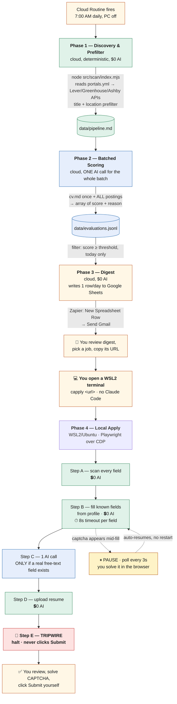

# Job Application Pipeline — Architecture

Base repo: https://github.com/LeoLaborie/claude-apply (forked to `rohanaluri/claude-apply`, private)
Orchestration: Claude Code Routines (cloud, Anthropic-managed) for Phases 1-3
Local execution environment: WSL2 (Ubuntu) on a Windows host
Notification: Google Sheets (Sheets API write) → Zapier (New Spreadsheet Row trigger) → Gmail

---

## 0. Key Decisions Log

Short-form index of key choices and why. Full reasoning for anything Phase-3 or
Routine-related now lives in Sections 5 and 8 — this list points there rather than
repeating it.

1. No AI agent reads pages turn-by-turn — Playwright walks/fills the page; AI only
   answers genuine free-text fields (see Section 6).
2. ~30 standard field types need zero AI — `field-classifier.mjs` matches them straight
   to profile data.
3. Phase 2 scoring is batched: one `claude -p` call for all pending offers, not one per
   job (see Section 4).
4. Phase 4 makes at most one AI call per application, only for fields with no
   deterministic match (see Section 6).
5. Runs on the existing Pro subscription — no separate API key needed at current volume.
6. Safety tripwire: the script never clicks Submit — you always do (see Section 6).
7. Local execution is WSL2/Ubuntu, not native Windows — the repo's setup script requires
   it (see Section 1).
8. Phase 2 sends extracted job text, not raw HTML — `jd-truncate.mjs` confirmed genuine
   section-based extraction, not a blunt cutoff.
9. No prompt caching anywhere in the pipeline — `claude -p` exposes no manual
   cache-breakpoint control; not worth bypassing it at current volume.
10. Phases 1-3 run on one strict daily cron trigger, not on-demand — protects the
    5-routine-run/day Pro cap (see Section 8).
11. Essay drafting happens only in Phase 4, for the specific job applied to — never
    pre-drafted in Phase 2.
12. No cloud Routine existed as of 2026-08-22 — resolved 2026-08-23/24, see Section 8.
13. Phase 3 delivers via Google Sheets → Zapier → Gmail, not a webhook — Zapier's
    Webhooks app turned out to be Premium-only; Sheets is free and doesn't reintroduce
    AI into Phase 3. Full story and mechanism in Section 5.
14. Score scale is 0-10 (not 1-100); `reason` is short bullets joined with `" | "`.
15. Phase 2's prompt was rewritten from French/internship criteria to English/US
    Associate-Data-Scientist criteria.
16. Phase 4 was promoted from POC to a real code-driven script — full detail in
    Section 6.
17. The digest writes one row per day, never one per job — keeps it a single combined
    email instead of N separate ones (see Section 5).
18. Google auth uses a service account, delivered two ways — a local key file for WSL2,
    an env var for the cloud Routine — never a committed key file (see Sections 5, 8).
19. The cloud Routine's network access must be Custom with explicit domains — the
    default "Trusted" level only allows package registries (see Section 8).
20. `npm install` belongs in the Routine's own instructions, not the Environment's setup
    script — the setup script's working directory isn't the repo root (see Section 8).
21. `candidate-profile.yml`'s schema is a strict field allowlist — new config keys must
    be added to it explicitly, and it gates Phase 1 regardless of which phase actually
    needs the new field (see Section 7's inventory).
22. `candidate-profile.yml` and `portals.yml` are force-committed despite the blanket
    `.gitignore` rule, since neither holds real secrets yet; `cv.md` was force-committed
    the same way on 2026-08-26 once we confirmed it also holds no real PII — only the
    service-account key remains deliberately uncommitted (see Section 8).
23. Phase 2 fetches Lever job bodies via Lever's public API (plain `fetch()`), not
    Playwright — the cloud Routine's sandbox proxy blocks real browser navigation
    entirely (`net::ERR_TUNNEL_CONNECTION_FAILED`), a known Claude Code sandbox
    limitation, not a fixable config issue. Playwright remains the fallback for
    non-Lever platforms — see Section 4.
24. **Phase 4's daily-use entry point is a direct terminal command (`capply`), not the
    `/apply` Claude Code slash command.** Every failure hit while testing `/apply` live
    (2026-08-27) traced back to Claude Code's own permission/tool-call layer — rejected
    prompts, silently-denied tool calls, one harness-level "internal error" — never the
    underlying script. `capply` (a one-line `~/.bashrc` function, see Section 1) runs
    `node src/apply/index.mjs` directly, with zero permission dialog in the path.
    `.claude/commands/apply.md` still exists and still works, but is no longer the
    documented way to run this day to day.
25. **Phase 4's captcha handling is pause-and-auto-resume, not detect-and-exit.**
    `waitOutCaptcha()` pauses the run, prints a clear message, polls every 3s until the
    challenge clears (10 min max), then continues on its own — no manual restart.
    Checked once per **field**, not per step, since hCaptcha triggers reactively partway
    through a burst of fills; a coarser check can miss a challenge that appeared and
    cleared entirely between two check points. Detection needed two rounds of tuning
    after live testing — see Section 6 for the false-positive history.
26. **Every field-fill attempt has an 8-second hard timeout (`FIELD_TIMEOUT_MS`).**
    Playwright's `selectOption()` does not fail fast when no option matches — it retries
    internally for ~30s, indistinguishable from the script being stuck. The fast-fail
    fix in Decision #27 resolves the known cases in milliseconds; the timeout remains as
    a general safety net for any future field that hangs for a reason not yet seen.
27. **Three field-handling bugs found via the first real full-form live test (Epoch AI,
    2026-08-27), all fixed:**
    - `experience_end`'s regex (`end.*(work|job)`) had no word boundary, so it matched
      "end" inside "int**end**" — "Which country do you **intend** to primarily **work**
      from?" was misclassified as a job end-date field. Fixed with `\bend\b` (and
      `\bstart\b` preventatively).
    - Personal-data classKeys were matching a radio-group's FULL question paragraph (up
      to 300 chars), not a short label — a Yes/No consent question mentioning "email" in
      passing became the email field. Fixed with a `RADIO_INVALID_KEYS` guard in
      `planFields()`; guards the whole class of long-paragraph false positives.
    - `fillSimple()`'s plain-`<select>` branch now checks for a real matching option
      BEFORE calling `selectOption()` — fails in milliseconds with a specific
      `no option matches "X"` reason instead of stalling.
28. **Lever's `applyUrl` is now captured alongside `hostedUrl` (2026-09-18).** The digest
    was sending `hostedUrl` (the posting overview page) as the thing to open and apply
    from; Lever's API separately returns `applyUrl`, the direct link to the form itself
    (same page + `/apply`). `hostedUrl` stays the `url` field (dedupe key, unchanged
    everywhere it's used); `applyUrl` is surfaced as a new `apply_url` field. `capply`
    (`src/apply/index.mjs`) also gained its own safety net —
    `normalizeApplyUrl()` appends `/apply` to any `jobs.lever.co` URL that's missing it,
    for anyone still pasting an overview link by hand. Only Lever was touched;
    Greenhouse and Ashby aren't implemented in this pipeline yet, so their apply-link
    shape hasn't been checked.
29. **Phase 2 (LLM scoring) and the top-10 Layer 2 cutoff are both dropped from the
    daily path (2026-09-18).** `src/scan/index.mjs` no longer ranks Layer 1 survivors by
    CV-embedding similarity or truncates to `MAX_OFFERS_TO_SCORE` — every offer that
    clears the regex/blacklist/location/date prefilter goes through. The Routine's
    instructions (Section 8) no longer call `node src/score/index.mjs --batch`. Both
    `src/score/` and `src/lib/embed-ranker.mjs` stay in the repo — nothing deleted, just
    unused by the daily Routine — in case scoring is worth re-enabling once real volume
    is observed without it.
30. **Cross-day dedupe moved from `scan-history.tsv` to the Jobs tab's `url` column
    (2026-09-18).** The cloud Routine does a fresh checkout every run — `data/` never
    survives between days — so `scan-history.tsv`-based dedupe only ever worked
    _within_ a single run, never across days, despite reading as if it did. The Jobs
    tab (`src/lib/google-sheets-jobs.mjs`) is the one piece of state that's actually
    durable: `digest` reads its `url` column before deciding what's new. If that read
    fails for any reason, the run stops without sending an email — a transient Sheets
    hiccup must never look like "zero new jobs" (see #31). `scan-history.tsv` and its
    role-level dedupe are unchanged and still useful for a single run with `--only` or
    manual re-runs.
31. **`digest` now sends every run, including a "0 new roles" email.** Previously,
    zero jobs scored above threshold meant no Sheets write and no email at all — which
    made a genuinely broken run indistinguishable from a quiet day. `digest` now always
    appends one Digest-tab row; a missing email is meant to mean something broke.
32. **`digest` no longer reads `data/evaluations.jsonl` for what to send.** With Phase 2
    removed from the daily path (#29), there's nothing new writing that file day to day.
    `scan` now hands its filtered survivors directly to `digest` via
    `data/todays-offers.json` (`src/lib/todays-offers.mjs`) — a hand-off file, not an
    accumulating log; it's overwritten every scan run. `digest` reads it, drops anything
    already in the Jobs tab (#30), appends the rest there in one batch call, THEN writes
    the Digest-tab summary row — in that order, so an email is never sent for jobs that
    didn't actually make it into the sheet. The email itself is now a summary (count,
    breakdown by platform, top companies, a link to the Jobs tab) rather than one card
    per job with a score and reasons — that detail lived in Phase 2's output, which no
    longer runs; the Jobs tab is where per-job detail (and the `capply_command` column)
    lives now.

---

## 1. Local Execution Environment

**Host:** Windows 11 PC with WSL2 (Ubuntu). Real Linux kernel, not emulation. GUI apps
(Chrome) forward to the Windows desktop natively via WSLg.

**Repo location:** `~/claude-apply` inside Ubuntu's own filesystem (not `/mnt/c/...`) —
avoids performance/permission issues when crossing the Windows/Linux boundary.

**Runtimes:** Node 20 via `nvm` (matching `.nvmrc`), Google Chrome installed inside Ubuntu
via `apt` — fully separate from Windows Chrome.

**Chrome CDP profile:** dedicated, isolated, launched via a `chrome-apply` alias in
`~/.bashrc`:

```bash
alias chrome-apply='"/usr/bin/google-chrome" --user-data-dir="/home/rohan/.config/google-chrome-claude-apply" --remote-debugging-port=9222 --disable-gpu --disable-software-rasterizer 2>/dev/null &'
```

**`--disable-gpu --disable-software-rasterizer 2>/dev/null` added 2026-08-27.** WSL2 has
no GPU hardware acceleration by default, so Chrome retried and failed WebGL rendering in
a loop, flooding the terminal with `ContextResult::kFatalFailure: WebGL1/WebGL2
blocklisted` and burying real script output — looked exactly like a hang, wasn't one.
**Gotcha:** editing this alias does NOT affect an already-running Chrome under the same
`--user-data-dir` — Chrome opens a new window in the existing process and ignores the new
flags. Kill it first:
`pkill -f "user-data-dir=/home/rohan/.config/google-chrome-claude-apply"`, confirm with
`ps aux | grep remote-debugging-port`, then relaunch.

Signed into the job-search Gmail account. `claude-in-chrome` extension installed in this
profile (its role is now unclear — see Open Items).

**`capply` — the real daily-use entry point (added 2026-08-27, Decision #24):**

```bash
capply() { (cd ~/claude-apply && node src/apply/index.mjs "$1"); }
```

Daily use is now `capply "<job-url>"`. Runs Phase 4 directly, bypassing Claude Code's
permission layer entirely. **Consequence: the terminal is now the sole record of a run** —
no Claude Code session transcript to review afterward — which is why live per-field
logging was added the same day (Section 6).

**GitHub auth:** `gh auth login`, browser OAuth, against the private fork.

**Claude Code:** still used for development/editing work in this project — just no longer
how Phase 4 gets invoked day to day (Decision #24).

**Playwright's headless Chrome (separate from `chrome-apply`):** used by Phase 2 for
non-Lever platforms only (Lever now uses a plain API call — Decision #23). Completely
separate browser install from the CDP-controlled Chrome. Ubuntu 26.04 isn't officially
supported by Playwright yet; workaround:

```bash
export PLAYWRIGHT_HOST_PLATFORM_OVERRIDE=ubuntu24.04-x64   # in ~/.bashrc — needed at runtime, not just install
npx playwright install chromium
```

**What doesn't run here:** Phases 1-3 run in the cloud Routine, cloning the repo fresh
each run (Section 8). This environment is specifically for Phase 4.

### 1a. File paths reference

All local terminal work uses **WSL2 Ubuntu bash** (prompt: `rohan@Rohans-PC:~/claude-apply$`).

| What | WSL2 path (bash) | Windows path (native) |
| --- | --- | --- |
| Windows Downloads folder | `/mnt/c/Users/rohan/Downloads/` | `C:\Users\rohan\Downloads\` |
| Repo root | `/home/rohan/claude-apply` (`~/claude-apply`) | `\\wsl$\Ubuntu\home\rohan\claude-apply` |
| Config dir | `~/claude-apply/config/` | `\\wsl$\Ubuntu\home\rohan\claude-apply\config` |
| Google service-account key (never committed) | `~/claude-apply/config/google-service-account.json` | — |

**Standard file-transfer pattern used throughout this project:**

```bash
md5sum /mnt/c/Users/rohan/Downloads/<filename>
cp /mnt/c/Users/rohan/Downloads/<filename> ~/claude-apply/<destination path>
md5sum ~/claude-apply/<destination path>   # confirm hashes match before committing
```

---

## 2. Architecture Diagram



_Renders automatically as a flowchart on GitHub. In VS Code, install the "Markdown Preview Mermaid Support" extension if it doesn't render._

**Note the two changes vs. earlier versions of this diagram:** the handoff from digest to
Phase 4 is now an explicit manual terminal step (`capply`, Decision #24) rather than a
Claude Code slash command, and the captcha pause/resume loop (Decision #25) is shown as a
real branch off the fill step, since it's now a normal part of a Lever run rather than a
failure mode.

**Not yet redrawn (2026-09-18):** this diagram still shows Phase 2 (batched scoring) on
the daily path from Phase 1 to Phase 3. As of Decisions #29 and #32, the daily Routine
skips Phase 2 entirely — Phase 1 hands its survivors straight to Phase 3 via
`data/todays-offers.json`, and Phase 3 gates on the Jobs tab (not `evaluations.jsonl`)
before writing the digest row. See Sections 3, 5 and 8 for the current mechanism; treat
the box for Phase 2 here as "exists in the repo, not on the daily path" until the
diagram itself is updated.

---

## 3. Phase 1 — Discovery & Prefilter (Cloud, $0 AI)

**Command:** `node src/scan/index.mjs`

**Confirmed working end-to-end in the real cloud Routine, with real live postings
(2026-08-26).** Scans every company in `config/portals.yml`, prefilters by
title/blacklist/location/date, dedupes against `data/scan-history.tsv`, appends survivors
to `data/pipeline.md`, and — since 2026-09-18 (Decisions #29, #32) — writes the same
survivors to `data/todays-offers.json` for Phase 3 to pick up. There is no ranking or
top-N cutoff anymore: every survivor goes through, not just the top 10 by CV-embedding
similarity.

**`portals.yml` and `target_locations` fixed 2026-08-26.** Tracked companies swapped to
confirmed-live Lever boards (PointClickCare, Analytic Partners, plus Mistral AI which
still returns 0 — possibly a wrong/empty slug, flagged but not blocking). Title filter
broadened from the original repo's `Intern/Internship/Stage/Stagiaire` to
`Data/Analyst/Scientist/Engineer`. Separately, `candidate-profile.yml`'s
`target_locations` was silently deriving to `["France", "Paris", "Remote"]` from the
placeholder `city`/`country` — added an explicit override (`Remote, United States, USA`)
so real US postings aren't dropped. Result: **19 real postings found** on the next run.

---

## 4. Phase 2 — Batched Scoring (Cloud, 1 AI call per run)

**Status: confirmed working end-to-end in production (2026-08-26).** 19 real postings in,
17 survived liveness filtering, scored in one `claude -p` call, 0 crossed the
`auto_apply_min_score` threshold (highest: 7.5) — expected, since `cv.md` is still Alice
Martin's placeholder profile scored against real US Principal/Senior roles. First real
proof of multi-offer batching (previously only N=1) and of `cv.md` loading in the cloud.

**Trigger:** strict single daily cron run (7:00 AM), not on-demand.

**Job description fetching — Lever via plain API, not a browser (Decision #23).**
`data/pipeline.md` only carries `url | company | title` between phases, so Phase 2
re-fetches each posting's body itself. It originally used Playwright to navigate the
rendered page, but the cloud sandbox's proxy blocks real browser navigation outright
(`net::ERR_TUNNEL_CONNECTION_FAILED`) — a known Claude Code sandbox architectural
limitation (the proxy doesn't support the CONNECT tunneling browsers need).

Debugging path before finding the real fix (durable lesson for any future
browser-in-cloud-sandbox issue):
1. `browserType.launch: Executable doesn't exist` — sandbox ships Chromium `-1194`, the
   npm package expected `-1217`. Fixed with `PLAYWRIGHT_BROWSERS_PATH=/opt/pw-browsers`.
2. Still failing, now looking for `chromium_headless_shell-1217` — Playwright defaults
   headless launches to a separate small "headless shell" binary since v1.49, which the
   sandbox doesn't have. Fixed with `channel: 'chromium'` to force the full binary.
3. Still pointing at a hardcoded version-numbered path. Real fix:
   `/opt/pw-browsers/chromium` is a symlink that always points at whatever version is
   installed — `executablePath` set to that symlink, conditional on `fs.existsSync()` so
   local WSL2 runs are unaffected.
4. Browser finally launched — then `net::ERR_TUNNEL_CONNECTION_FAILED` on every fetch.
   Confirmed as a known limitation via `anthropics/claude-code#11791`: "Browser
   automation tools (Playwright, Puppeteer, Selenium) are not supported in the web
   sandbox environment."

**Actual fix:** for Lever URLs, `fetchOfferBody()` calls the same public board API Phase 1
already uses successfully in this sandbox (`api.lever.co/v0/postings/{slug}?mode=json`,
plain `fetch()`, already allowlisted), pulling `descriptionPlain` from the posting matched
by `hostedUrl`. Non-Lever platforms still fall back to Playwright — untested in the cloud
and likely to hit the same wall (see Open Items).

**Input text is extracted, not raw HTML.** `jd-truncate.mjs` keeps
Responsibilities/Requirements/Qualifications, drops About-us/Benefits/EEO boilerplate,
caps at `jdMaxTokens` (default 1500/offer, applied per-offer even in the batched path).

**Prompt shape (one call, whole batch):**

```
System: [cv.md] + English, US Associate-Data-Scientist scoring criteria
User:   [offer 1 + url], [offer 2 + url], ... [offer N + url]
```

**Response**, matched back by URL (not response order, so a dropped or reordered entry
can't corrupt another offer's result):

```json
[{ "url": "...", "score": 8.5, "reason": ["Strong Python/SQL match", "Entry-level"] }]
```

**Output:** `data/evaluations.jsonl`, one line per offer — **low scores are recorded, not
discarded**, each with its score and 2-3 bullet reason, so you can sanity-check the
model's judgment on rejected postings.

---

## 5. Phase 3 — Digest (Cloud, $0 AI, Google Sheets → Zapier → Gmail)

**Status: confirmed working end-to-end 2026-08-24** (original evaluations-based version).
**Rewritten 2026-09-18** to drop Phase 2 scoring from the daily path — see Decisions
#28-32. Not yet re-verified live against a real cloud Routine run as of this writing;
verify with `--dry-run` first, then a real run, before trusting it unattended.

**Mechanism (current):**

1. `node src/scan/index.mjs` writes `data/todays-offers.json` at the end of every non-
   dry-run — every Layer 1 survivor from that run (`src/lib/todays-offers.mjs`). This
   file is a hand-off, not a log: it's overwritten each run, not appended to.
2. `node src/digest/index.mjs` reads that file, then reads the Jobs tab's `url` column
   (`src/lib/google-sheets-jobs.mjs`) — the durable cross-day record, since `data/`
   doesn't survive between cloud Routine runs (Decision #30). **If that read fails, the
   run stops here — no Jobs write, no email.**
3. Offers whose `url` isn't already in the Jobs tab are appended there in **one batch
   call**: `date_found | company | title | location | url | platform | apply_url |
   status | notes | capply_command` (`status`/`notes`/`capply_command` left blank —
   see the Jobs tab's own setup below).
4. **Only after that append succeeds**, one row is appended to the Digest tab: `date`,
   `subject`, `job_count`, `body`. `body` is now a *summary* — new-role count, a
   breakdown by platform, top companies, and a link to open the Jobs tab — not one card
   per job with a score and reasons, since that detail came from Phase 2's output,
   which no longer runs. **This row is written every run, including 0 new roles**
   (Decision #31) — a missing email should mean something broke, not "quiet day".
5. Zapier watches the Digest tab — **Trigger: Google Sheets → "New Spreadsheet Row"**
   (Instant) → **Action: Gmail → "Send Email"**, Subject/Body mapped from the row.
   **Body type: HTML** (unchanged — the Digest tab's column shape and the Zap itself
   didn't need to change for this rewrite).

**Google Sheet:** "Daily Application Digest" (same spreadsheet for both tabs).
- **Digest tab** — columns `date | subject | job_count | body`, unchanged.
- **Jobs tab** — columns `date_found | company | title | location | url | platform |
  apply_url | status | notes | capply_command` (confirmed with Rohan 2026-09-18). One-
  time setup, done by hand, not by code: header row; a `status` dropdown (data
  validation) with whatever values are useful (`applied`, `skip`, etc.); and a
  `capply_command` formula. **Use an `ARRAYFORMULA` in the header row** (e.g.
  `={"capply_command"; ARRAYFORMULA(IF(E2:E="", "", "capply """&G2:G&""""))}` — adjust
  column letters to taste) rather than a per-row formula, so every row `digest` appends
  picks it up automatically; a per-row formula would need `digest` to write it, which
  it deliberately doesn't (writing into a formula column would overwrite the formula).

Spreadsheet ID in `candidate-profile.yml` as `digest_sheet_id`, shared by both tabs
(resolution: `--sheet-id` flag → `$GOOGLE_SHEETS_DIGEST_ID` → profile). Tab names:
`digest_sheet_name` (default `Digest`), `jobs_sheet_name` (default `Jobs`). Optional
`jobs_sheet_gid` makes the digest email's "Open the Jobs tab" link land on that exact
tab instead of the spreadsheet's default view.

**Auth — Google service account:** `digest-writer@claude-apply.iam.gserviceaccount.com`,
scoped to `spreadsheets` only, shared as Editor on the target Sheet. Dual-path credential
delivery (Decision #18): local key file at `config/google-service-account.json` via
`$GOOGLE_APPLICATION_CREDENTIALS` for WSL2 runs; the same key's raw JSON as the
`GOOGLE_SERVICE_ACCOUNT_JSON` env var on the cloud Environment.
`buildSheetsClient()` checks the env var first, falls back to the file.

**Why Zapier Free is sufficient:** Sheets and Gmail are both non-premium, fitting Free's
2-step limit. Trigger checks never consume tasks — only the Gmail send does, ~1 task/day
against a 100/month allowance.

**`--dry-run` skips the Jobs tab read (assumes every candidate offer is new) and prints
what would be appended to both tabs; writes nothing.**

---

## 6. Phase 4 — Local Apply (WSL2/Ubuntu, 0-1 AI calls, TRIPWIRE)

**Status: first real full-form live test completed successfully (2026-08-27)** — a real
20-field Lever application (Epoch AI, Data Scientist), run via `capply`, start to finish,
**no hangs**, tripwire correctly stopped at Submit. Result: **7 filled, 13 flagged for
review (6 required)**, every field resolving in well under a second except the one AI
call. This followed a full day of debugging real, reproducible bugs — documented below,
since the debugging path matters as much as the fixes.

**Why `/apply` was retired as the daily path (Decision #24).** Every `/apply` failure
traced to Claude Code's permission/tool-call layer — a rejected Bash prompt, a tool call
silently denied when a new message arrived while the dialog was open, one harness-level
"Tool result missing due to internal error." The script never executed in any of those
cases. `capply` runs it directly. **Consequence: the terminal is the only record of a
run**, which motivated the logging work below.

**Captcha handling — pause-and-auto-resume (Decision #25).** Lever's hCaptcha triggers
*reactively during filling* based on interaction patterns — a real, observed behavior,
not just a page-load gate. `waitOutCaptcha()` pauses, prints a message, polls every 3s,
and resumes automatically once solved. Checked after **every individual field**, since a
per-step check can land entirely inside the window where a challenge appeared and
cleared. Confirmed working live across two runs (captcha appeared mid-fill, cleared in
6-9s, filling resumed correctly).

Detection needed two rounds of tuning, both from real false positives:
- **DOM presence was too broad.** Lever embeds a *dormant, invisible* hCaptcha widget on
  every page for passive bot-scoring. A presence-only iframe check flagged it as an
  active challenge on every run. Fixed by requiring real rendered visibility (non-zero
  size, not `display:none`/`visibility:hidden`).
- **Text patterns were too broad.** The original `/captcha/i` and `/challenge/i` matched
  Lever's own "protected by hCaptcha" footer and the word "challenge" in ordinary job
  descriptions — causing false 10-minute stalls. Narrowed to active-challenge phrasing
  only ("verify you are human", "i am not a robot", Cloudflare interstitial text).

**Every field-fill attempt has an 8-second timeout (Decision #26).** `selectOption()`
doesn't fail fast when no option matches — it retries internally for ~30s, which is
indistinguishable from a hang. This is what made the country and EEO dropdowns *appear*
stuck before the real cause was found. Any field that can't resolve now fails within 8s
with a logged reason, and the run continues.

**Live per-field terminal logging (added same day).** Every field prints its outcome the
instant it resolves, plus phase markers for config load, Chrome connect, page open, each
step's scan, and the AI call (explicitly announced before dispatch, since it's the one
legitimately slow step). Sample:

```
✓ profile + cv.md loaded
→ connecting to Chrome DevTools at http://localhost:9222...
✓ connected to Chrome
Detected: company="Epoch AI"  role="Data Scientist"  language=en

── step 1: 20 field(s) found, filling now ──
  [fill]    ✓ full_name        → Alice Martin
  [review] ✗ location          — location autocomplete: no value confirmed
  → calling Claude for 4 free-text question(s) (this can take 10-30s)...
  ✓ AI responded (usage={...})
```

Before this, "working slowly" and "genuinely stuck" were indistinguishable from the
terminal — which caused real debugging confusion earlier the same day.

**Three field-handling bugs found and fixed via live testing (Decision #27):**
- **Word-boundary bug:** `experience_end`'s `end.*(work|job)` matched "int**end**",
  misclassifying "Which country do you intend to primarily work from?" as a job end-date
  field. Fixed with `\bend\b`/`\bstart\b` in `field-classifier.mjs`.
- **Long-paragraph misclassification:** personal-data classKeys were matched against a
  radio-group's full question paragraph (up to 300 chars from the DOM label-reader), so a
  Yes/No consent question mentioning "email" in its explanatory text became the email
  field. Fixed with a `RADIO_INVALID_KEYS` guard in `planFields()` — those classes can
  never legitimately describe a Yes/No question, so a match falls back to `unknown`.
- **Slow-fail selects:** `fillSimple()`'s plain-`<select>` branch now verifies a matching
  option exists before calling `selectOption()`. Confirmed via the real HTML of Epoch
  AI's country dropdown that this is a **plain native `<select>`**, not a custom React
  widget as originally suspected — the "custom widget" theory was wrong, and the real
  cause was purely a value mismatch.

**Precondition:** `chrome-apply` running (see Section 1's GPU-flag fix).

**Step A — Scan the page ($0 AI):** Playwright over CDP walks the page; label extraction
uses `dom-label.browser.js`, handling Lever/Ashby/Greenhouse label patterns plus generic
`label[for]`/`aria-label` fallbacks.

**Step B — Classify and fill standard fields ($0 AI):** `classifyField()` matches ~30
known patterns; `mapProfileValue()` pulls answers from `candidate-profile.yml`. Pure
regex, no AI. React-based dropdowns handled by `react-select-helper.mjs`.

**Step C — Free-text fields (1 AI call, only if needed):** only `free_text` fields need a
generated answer. One prompt covers all of them: questions + `cv.md`, grounded, 80-150
words, "never invent experience." Forms with only standard fields need **zero** AI calls.
**This is the only place in the pipeline an essay is ever written** (Decision #11).

**Step D — Resume upload ($0 AI):** `upload-file.mjs` sets the file directly on the
`<input type="file">` via CDP. **Still never exercised in a real `capply` run** — the
2026-08-27 test correctly flagged `cv_upload` for review because `config/cv.pdf` doesn't
exist yet (only `cv.md`). See Open Items.

**Step E — TRIPWIRE:** halts unconditionally at the review screen, never calls Submit.
Confirmed working in the live test — detected the real "Submit application" button and
stopped.

**Real first-run results (Epoch AI, 20 fields):** 7 filled (full_name, email, phone,
experience_company, linkedin, experience_start, one AI free-text answer). 13 flagged —
mostly expected gaps (`cv_upload` no PDF; `location` known gap; 3 fields with no
classifier rule, correctly `unknown` rather than guessed; 3 free-text questions Claude
correctly declined per its grounding rules, one of which required filling out a separate
Google Doc). One real open bug: **`work_auth` "no confident option match"** — the profile
holds a descriptive sentence ("EU citizen — no sponsorship needed") but `chooseOption()`
only recognizes literal yes/no/true/false for a Yes/No radio. See Open Items.

---

## 7. Verified Reusable Code Inventory

Every file below was opened and read directly — not assumed from the README.

| File | Confirmed contents | AI involved? |
| --- | --- | --- |
| `field-classifier.mjs` | `classifyField()` — regex-matches ~30 field types; `mapProfileValue()` — maps to profile data. **Fixed 2026-08-27:** word-boundary bug in `experience_end`/`experience_start` (Decision #27). | No |
| `dom-label.mjs` / `dom-label.browser.js` | `extractLabel()` — finds a field's human label across ATS-specific patterns; `clickInQuestion()` — clicks a radio/checkbox by question+choice text | No |
| `react-select-helper.mjs` | `REACT_SELECT_SNIPPET` — opens and selects from React-Select-style dropdowns | No |
| `upload-file.mjs` | `uploadFile()` — genuine Playwright `connectOverCDP` file upload. Works in isolation; not yet exercised in a real run (no `cv.pdf`) | No |
| `step-detect.mjs` | `detectStep()` — detects multi-step flow position via URL/DOM markers, Workday-shaped | No (see Open Items) |
| `confirmation-detector.mjs` | Old success/fail page detection — dead code since the tripwire patch | No |
| `accounts.mjs` | Per-ATS email aliases + random passwords for platforms requiring account creation | No |
| `language-detect.mjs` | Detects French vs. English from posting text; **defaults to French when ambiguous** | No |
| `cover-letter.mjs` / `letter-generator.mjs` | Optional cover-letter generation via `claude -p` | **Yes, if used** |
| `apply-log.mjs` | JSON-line logging of each apply attempt | No |
| `score/prompt-builder.mjs` | `buildPrompt()` / `buildBatchPrompt()` — English/US criteria, 0-10 scale, `{score, reason}` | Builds Phase 2's prompt |
| `score/jd-truncate.mjs` | `truncateJd()` — genuine section-based extraction, not a blunt cutoff | No |
| `score/index.mjs` | `fetchOfferBody()` — Lever via plain `fetch()` to the public board API (Decision #23); non-Lever falls back to Playwright. `--batch` builds one prompt for all pending offers | 1 batched call per `--batch` run |
| `apply/index.mjs` | Phase 4 orchestrator. **Substantially rewritten 2026-08-27:** `waitOutCaptcha()` pause/resume (#25), `FIELD_TIMEOUT_MS` per-field cap (#26), live per-field logging, `RADIO_INVALID_KEYS` guard + fast-fail `<select>` (#27). Confirmed live against a real 20-field Lever form via `capply`. Does NOT yet call `cover-letter.mjs` | 1 batched call per page, free-text only |
| `.claude/commands/apply.md` | Thin wrapper around `index.mjs`. Still functional, **no longer the documented daily-use path** (Decision #24) | No |
| `digest/index.mjs` | **Rewritten 2026-09-18.** Reads `data/todays-offers.json` (not `evaluations.jsonl`), reads the Jobs tab's `url` column for cross-day dedupe, appends new jobs there, then appends a summary row to the Digest tab — every run, including 0 new. Auth via env var (cloud) or file (local), unchanged. | No |
| `lib/candidate-profile.schema.mjs` | `validateProfile()` — strict allowlist; rejects unknown keys. Updated 2026-08-24 (digest keys) and 2026-08-26 (`target_locations`) | No |
| `lib/load-profile.mjs` | `loadProfile()` — reads + validates the profile; called by both scan and score, which is why a schema mismatch blocks Phase 1 even for a Phase-3-only field (Decision #21) | No |

---

## 8. Cloud Routine & Environment Configuration

**Status: confirmed working end-to-end with real data 2026-08-26** (original 4-step,
scoring-included version). **Instructions rewritten 2026-09-18** to drop the scoring
step (Decisions #29, #32) — not yet re-verified against a real cloud Routine run; do a
manual "Run now" and check the resulting email/Jobs tab before trusting the schedule.

**Routine name:** "Job Pipeline — Scan, Score, Digest" (name kept as-is; rename to "Job
Pipeline — Scan, Digest" if that stops being confusing — not required for correctness).
**Repository:** `rohanaluri/claude-apply`
**Trigger:** Schedule → Daily → 7:00 AM EDT (Decision #10)
**Environment:** custom cloud Environment `claude-apply` — NOT the account's default
"Daily Notifications" Environment, which belongs to an unrelated morning-news Routine.

**Instructions (the Routine's actual prompt) — current, 3-step:**

```
Run the daily job-pipeline steps in this exact order, from the repo root:

1. npm install
2. node src/scan/index.mjs
3. node src/digest/index.mjs

Run each command exactly as written — do not modify flags, do not skip
steps, and do not improvise alternate commands if one fails. If any
command exits with a non-zero code, stop immediately and report the
exact error output rather than attempting to continue or fix it.

After both scan and digest complete successfully, report a short
summary: how many new postings the scan found, how many of those were
already in the Jobs tab (so weren't re-sent), and how many new rows the
digest actually appended to the Jobs tab today.
```

**Previous 4-step version (kept here for reference, no longer used):**

```
1. npm install
2. node src/scan/index.mjs
3. node src/score/index.mjs --batch    # ← removed, Decision #29
4. node src/digest/index.mjs
```

`node src/score/index.mjs --batch` was removed from the instructions, not deleted from
the repo — `src/score/` still exists and still works standalone (`/score <url>`,
`npm run score:batch`) if scoring is ever worth re-enabling.

`npm install` is step 1 of the *instructions*, not the Environment's setup script —
Decision #20 for why that split matters.

**Custom Environment `claude-apply` configuration:**
- **Network access:** Custom (not "Trusted" — Decision #19), allowing:
  - `api.lever.co` (Phase 1 scan, and Phase 2's Lever body-fetch — Decision #23)
  - `sheets.googleapis.com`, `oauth2.googleapis.com` (Phase 3)
  - "Also include default list of common package managers" — checked, so `npm install`
    works alongside the custom domains
  - **Not yet added, needed if `portals.yml` grows:** `api.ashbyhq.com`,
    `*.myworkdayjobs.com` per company
  - **Deliberately NOT added:** `cdn.playwright.dev` — an attempted
    `npx playwright install chromium` step 403'd on this domain, then turned out to be
    unnecessary once `PLAYWRIGHT_BROWSERS_PATH` pointed at the pre-installed browser
- **Environment variables:**
  - `GOOGLE_SERVICE_ACCOUNT_JSON` — full key JSON, single-line (Decision #18)
  - `PLAYWRIGHT_BROWSERS_PATH=/opt/pw-browsers` — added 2026-08-26 (Decision #23)
- **Setup script:** still contains a leftover, now-redundant `npm install` — harmless,
  see Open Items.

**Daily-run cap:** Pro allows 5 automated Routine runs/day, **shared across the account**,
not per-Routine. This account has 2 Routines total (this one + an unrelated morning-news
briefing), comfortably under. Manual "Run now" clicks do **not** count — used extensively
during debugging 2026-08-24 through 2026-08-27 with no budget concern.

---

## 9. Open Items

- [x] ~~Top-level Phase 4 orchestration script doesn't exist yet.~~ **Resolved 2026-08-22.**
- [x] ~~The real Zapier webhook doesn't exist yet.~~ **Superseded 2026-08-24 (Decision #13)** — Sheets → Zapier → Gmail instead, tested with a real received email.
- [x] ~~No cloud Routine has been created yet.~~ **Resolved 2026-08-23/24.**
- [x] ~~`portals.yml`'s tracked companies are mostly stale/wrong.~~ **Resolved 2026-08-26** — live Lever boards, broadened title filter, explicit `target_locations`. 19 real postings on the next run.
- [x] ~~Phase 2's multi-offer batching is unproven in production.~~ **Resolved 2026-08-26** — 17 live offers, one batch call, real distinct scores.
- [x] ~~`config/cv.md` is uncommitted and never exercised by a cloud run.~~ **Resolved 2026-08-26** — force-committed, confirmed read in the cloud.
- [x] ~~`/apply` hangs or fails with no clear cause, hard to debug.~~ **Resolved 2026-08-27 (Decisions #24-27)** — root-caused to Claude Code's permission layer plus real, now-fixed bugs. `capply` + live per-field logging replace the opaque flow.
- [ ] **`work_auth` "no confident option match" — real, unresolved.** `work_authorization`
      is a descriptive sentence ("EU citizen — no sponsorship needed"), but
      `chooseOption()` only recognizes literal yes/no/true/false for a Yes/No radio.
      Needs a design decision: a dedicated boolean profile field, or deriving yes/no from
      the existing text.
- [ ] **No classifier rule for "which country do you work from" questions**, despite the
      profile already having a `country` field that answers it. Currently correctly falls
      to `unknown`/review. Cheap win — we already have the real HTML (a plain `<select>`
      with ~195 country options).
- [ ] **EEO dropdown defaults don't match real on-page option text.** Code defaults to
      `'Prefer not to say'`; Epoch AI's Lever form says "Decline to self-identify". Now
      fails fast with a clear reason (Decision #26) rather than hanging, but the mismatch
      is unresolved — and likely varies by company, so a single hardcoded default may
      never reliably match. Worth reusing `chooseOption()`'s existing decline-detection
      logic for select-type EEO fields, not just radio-groups.
- [ ] **`config/cv.pdf` doesn't exist — only `cv.md`.** Resume upload has therefore never
      run in a real `capply` session. Needs a real PDF at the profile's `cv_path`.
- [x] ~~Phase 3's digest still says `/apply <url>`, not `capply "<url>"`.~~ **Resolved
      2026-09-18 (Decision #32)** — the digest email no longer includes a per-job apply
      command at all; that moved to the Jobs tab's `capply_command` formula column.
- [ ] **`google-service-account.json`'s key was pasted into chat history during setup.**
      Rotate as routine hygiene once Phase 3 iteration settles. Low risk (Sheets-only
      scope, one non-sensitive spreadsheet, solo account).
- [ ] **Digest emails render as plain text** — Markdown shows literally. Deliberate POC
      simplification; upgrading needs a Markdown→HTML step in the Zap or HTML rendering
      in `digest/index.mjs`.
- [ ] **Non-Lever platforms still use Playwright for Phase 2 body-fetching, unproven in
      the cloud sandbox.** Greenhouse and Ashby both already expose body text via their
      own public APIs (`fetchGreenhouse`, `fetchAshby` map a `body` field the same way
      `fetchLever` does), so Decision #23's fix pattern applies directly when needed.
      Workday is harder — its listing API returns no descriptions and per-posting
      detail-fetch is explicitly unimplemented.
- [ ] **Network allowlist only covers Lever + Google APIs** — adding Ashby or Workday
      companies will need their domains added, or those scans silently 403-fail.
- [ ] **The Environment's setup script still has a redundant `npm install`** — harmless,
      worth clearing for cleanliness.
- [ ] **Location-autocomplete fill still not working.** Detection is correct (routes to a
      dedicated `location` action), but the fill — typing + selecting a real suggestion —
      has failed on every live test including 2026-08-27. Needs the real widget's HTML
      (input + suggestion item) to build an accurate selector instead of the current
      generic guess.
- [ ] **Several field types still have no classifier rule** — correctly routed to review
      rather than guessed, but worth adding as volume grows: "how did you hear about us"
      (a multiple-choice radio), "timezone relocation willingness", skill-rating
      questions, "what US state do you reside in".
- [ ] **Radio-group EEO/Yes-No matching is intentionally conservative.** `chooseOption()`
      refuses to guess on unrecognized phrasing — correct by design, but means many
      required fields need manual selection until the known-phrasing list grows from real
      examples. (Distinct from the select-type EEO gap above — select fields don't go
      through `chooseOption()` at all.)
- [ ] **Cover-letter generation isn't wired into `index.mjs`.** `renderLatex()` exists and
      is real, but `cover_letter_*` fields currently route to manual review.
- [ ] **Only tested on one ATS (Lever), two companies (PointClickCare, Epoch AI).**
      Everything platform-specific in the Phase 4 fixes is Lever-shaped and unverified
      elsewhere.
- [ ] **Workday step-detection conflict.** `step-detect.mjs` has real Workday-shaped
      signatures, but the README says Workday `/apply` isn't implemented. Don't assume it
      works — may be partial scaffolding.
- [ ] **Account-creation flow (`accounts.mjs`) isn't in this design yet.** Some ATS
      platforms require a login before applying.
- [ ] **`claude-in-chrome`'s role is unclear** now that Phase 4 is code-driven and invoked
      via `capply` without Claude Code at all. May not be needed.
- [ ] **`cv.md` and `candidate-profile.yml` are still templates.** Real data needed before
      either phase produces meaningful output. (This is why every Phase 2 score has been
      low/skip — expected, not a bug.)
- [ ] Confirm the 5/day Routine cap stays comfortable alongside normal interactive Claude
      Code usage.
- [ ] **Real per-call cost measured: $0.11 for one offer, cache miss.** Still need a
      same-day repeat run for a real `cache_read` repeat-call cost. The 2026-08-26 batch
      call (17 offers, one call) is a second data point worth pulling from its logged
      `[usage]` line.

---

_Every code claim in this document was verified by opening the actual file — either
directly, or pasted from the user's local clone when direct access wasn't possible.
If anything here turns out to be wrong, verify by reading the real file again before
changing the design — don't reason from the README or from what a related file implies._
